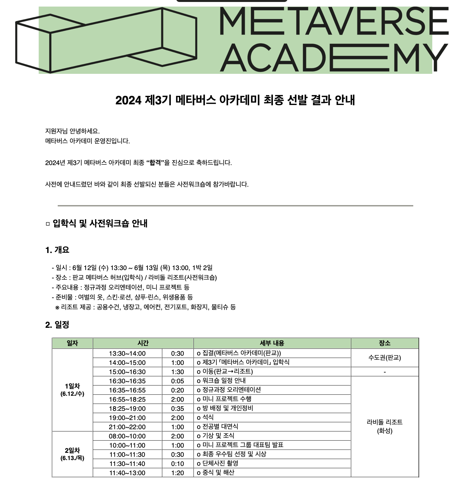

본과정 이 시작되었다 

나는 3기 메타버스 아카데미에 합격을 하였고\
워크샵을 오게되었다.

아직 모든것이 서툴지만 유능한 강사님들과 동기들과 함께 새로운 사건울 보내보려 한다.\

=== 입학식 시작전 === 

(이후 일정에 대한 추가적인 작성)

생각보다 많은 연관된 기업들이 많은거 같다.
과학기술정보통신부 정보통신산업진흥원 한국전파진흥협회

사전과 같이 5개의 분과 언리얼, 유니티, 디자인, 기획, AI 가 dlTdmauu 

조금 뜸금 없지만 연예인의 응원 영상이 나온다?
🧐

다음으로는 메타버스 과정의 성과를 알려주고

205강사님이 나온다?
아마 주최하는데 제일 공을 들이셔서 강사 대표로 나오신거 같다.

과정의 목표

studio가 가능한 환격을 만드는 것을 목표로 하는것 같다.

버스를타고 화성으로 왔다.

5분이 모였고

unity : 박정훈(대구), 이동수(판교)
ai : 