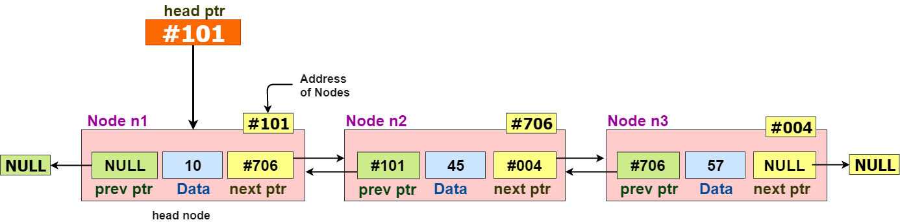

list

std library 에서 제공하는 list는 기본적으로 양방향 리스트를 제공하고 있다.

양방향 리스트(doubly linked list) 형태를 띠고 있다




상위 이미지와 같은 형식을 가지고 있기 때문에\
데이터를 양방향으로 노드를 컨트롤 하는 구조로 되어있다.

## method

다양한 메서드가 있음으로 [cppreference](https://en.cppreference.com/w/cpp/container/list) 페이지를 참고하여 현재 상황을 확인하기 바라란다


## 예시

```cpp filename="main.cpp"
#include <iostream>
#include <list>

int main()
{
    std::list<int> myList;

    for (int i = 0; i < 50 ; i += 10)
    {
        myList.push_back(i);
    }

    *(myList.begin()) = 42;

    std::cout << myList.front() << std::endl;
    std::cout << myList.back() << std::endl;

    return 0;
}
```

iterator 에 대한 간단한 예시

```cpp filename="main.cpp"
#include <iostream>
#include <list>

int main()
{
    std::list<int> myList;

    for (int i = 0; i < 50 ; i += 10)
    {
        myList.push_back(i);
    }
    std::list<int>::iterator it = myList.begin();
    std::cout << "== iterator test ==" << std::endl;
    std::cout << *it << std::endl;
    std::advance(it, 3);
    std::cout << *it<< std::endl;

    myList.insert(it,3);

    // myList.emplace_front(10); // (C++11) 사용을 하고 싶다면 c++ main.cpp -std=c++11 -stdlib=libc++ 로 11 버전을 컴파일하라

    std::cout << "== list value ==" << std::endl;
    for (std::list<int>::iterator i = myList.begin(); i != myList.end(); i++)
    {
        std::cout << *i << std::endl;
    }
    return 0;
}
```
상위처럼 iterator로 포인터위치를 연산자로도 이동이 가능하며 이동한 곳에 값을 insert 하는것이 가능하다\
필자는 이러한 방식이 육안적으로 다가와 상위 형태를 선호한다

```cpp filename="main.cpp"
#include <iostream>
#include <list>


std::ostream& operator<<(std::ostream& ostr, const std::list<int>& list)
{
    for (std::list<int>::const_iterator i = list.begin(); i != list.end(); i++){
        ostr << ' ' << *i;
    }
    return ostr;
}

int main()
{
    std::list<int> myList1;
    std::list<int> myList2;

    for (int i = 0; i < 5 ; i += 1)
    {
        myList1.push_back(i);
        myList2.push_back(i * 10);
    }

    std::cout << "== list value  ==" << std::endl;
    std::cout << "myList1: [" << myList1 << " ]" << std::endl;
    std::cout << "myList2: [" << myList2 << " ]" << std::endl;

    std::list<int>::iterator it = myList1.begin();
    std::advance(it, 3);
    
    myList1.splice(it, myList2);

    std::cout << "== list value splice 1 ==" << std::endl;
    std::cout << "myList1: [" << myList1 << " ]" << std::endl;
    std::cout << "myList2: [" << myList2 << " ]" << std::endl;

    myList2.splice(myList2.begin(), myList1, it, myList1.end());

    std::cout << "== list value splice 2 ==" << std::endl;
    std::cout << "myList1: [" << myList1 << " ]" << std::endl;
    std::cout << "myList2: [" << myList2 << " ]" << std::endl;
    return 0;
}
```
상위 예제는 스플릿을 사용하는 코드이다.

이와같이 원하는 부분의 노드를 잘라 붙히고 이어주는 것이 가능하다.

```txt filename="output"
== list value  ==
myList1: [ 0 1 2 3 4 ]
myList2: [ 0 10 20 30 40 ]
== list value splice 1 ==
myList1: [ 0 1 2 0 10 20 30 40 3 4 ]
myList2: [ ]
== list value splice 2 ==
myList1: [ 0 1 2 0 10 20 30 40 ]
myList2: [ 3 4 ]
```

> [!TIP]
> insert emplace 차이 정리


remove_if(IsEven); 에대하여 정리하기

inplace_back 에 대하여 메모리가 부족하면 여러가지 메모리를 증가시키기 위해 작업을 한다.

참고 사이트

[cppreference.com](https://en.cppreference.com/w/cpp/container/list)\
[simplesnippets.tech](https://simplesnippets.tech/doubly-linked-list-data-structure-all-operations-c-program-to-implement-doubly-linked-list/)
