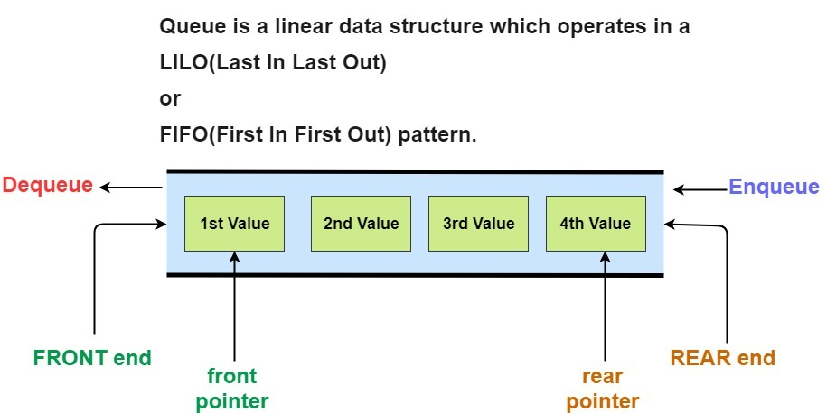

queue

큐는 하나씩 데이터를 넣고 반대편으로 빼는 데이터 저장방법이다.

선입선출(First In First Out)형식을 가지게 되고



상위 이미지와 같은 형식을 가지고 있기 때문에\
데이터를 양방향으로 컨트롤 하는 구조로 되어있다.

## method

| 메서드 | 설명 |
| --- | --- |
| back | 마즈막 데이터를 보여준다|
| emplace | 값을 수정한다, 복사나 이동이 아닌 집접적인 메모리의 값을 수정한다 |
| empty | queue에 하나라도 값이 존제하는지 알려준다 |
| front | 처음 데이터를 보여준다 |
| pop | 처음으로 온 데이터를 반환해준다. |
| push | 데이터를 넣어준다. |
| size | queue에 저장된 값의 갯수를 반환한다. |
| swap | 스텍의 주소를 서로 변경한다. |

## 예시

```cpp filename="main.cpp"
#include <iostream>
#include <queue>

int main()
{
    std::queue<int> myQueue;

    myQueue.push(10);
    myQueue.push(20);
    myQueue.push(30);
    myQueue.pop();
    std::cout << myQueue.front() << std::endl;
    std::cout << myQueue.back() << std::endl;

    return 0;
}
```

참고 사이트

[cppreference.com](https://en.cppreference.com/w/cpp/container/queue)\
[simplesnippets.tech](https://simplesnippets.tech/what-is-queue-data-structure-queue-operations-working-c-program-to-implement-queue-operations/)
