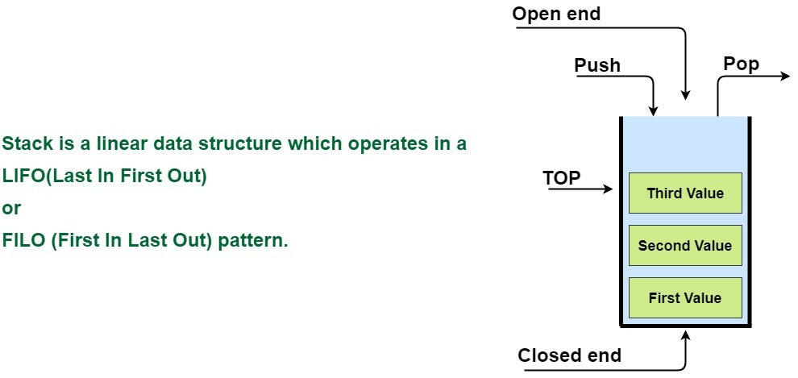

stack

스택은 하나씩 쌓는 형식의 데이터 저장방법이다.

후입선출(First In Last Out)형식을 가지게 되고



상위 이미지와 같은 형식을 가지고 있기 때문에\
데이터를 가져올때 마즈막에 온 데이터가 움직일 수 있는것을 볼 수 있다.

## method

| 메서드 | 설명 |
| --- | --- |
| emplace | 값을 수정한다, 복사나 이동이 아닌 집접적인 메모리의 값을 수정한다 |
| empty | stack에 하나라도 값이 존제하는지 알려준다 |
| pop | 마즈막으로 온 데이터를 반환해준다. |
| push | 데이터를 넣어준다. |
| size | stack에 저장된 값의 갯수를 반환한다. |
| swap | 스텍의 주소를 서로 변경한다. |
| top | 최상위 데이터를 보여준다. |

## 예시

```cpp filename="main.cpp"
#include <iostream>
#include <stack>

int main()
{
    std::stack<int> myStack;

    myStack.push(10);
    
    std::cout << myStack.top() << std::endl;

    return 0;
}
```
참고 사이트

[cppreference.com](https://en.cppreference.com/w/cpp/container/stack)\
[simplesnippets.tech](https://simplesnippets.tech/what-is-stack-data-structure-c-program-to-implement-stack-ds-operations/)
