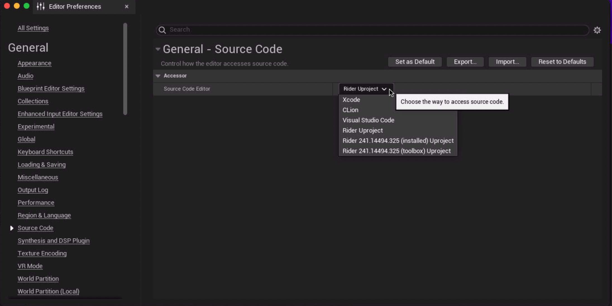
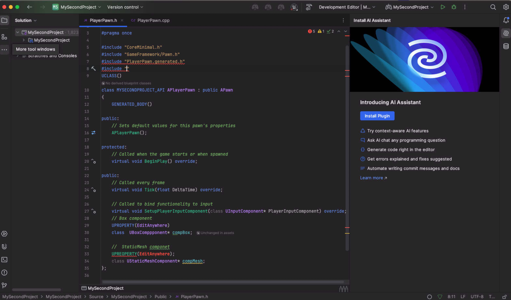

import { Callout } from 'nextra/components'
 
<Callout type="info" emoji="⚠️">
필자는 jetbrain lisence 가 있어서 ```Rider```를 사용 하였다.
</Callout>

xcode에서 라이브러리를 제공 해주지 않기 때문에 작성한 코드의 에러사항을 찾지 못하여 불편한 점이 많았다.\
그럼으로 ```jetbrain```의 cpp IDE를 사용하기로 하였고 보다 직관적인 코드 스타일을 볼 수 있게 되었다.

사용방법

```unreal Preferences``` -> ```General``` -> ```Source Code``` 원하는 에디터로 수정을 한다.





참고

[https://www.jetbrains.com/ko-kr/lp/rider-unreal](https://www.jetbrains.com/ko-kr/lp/rider-unreal)