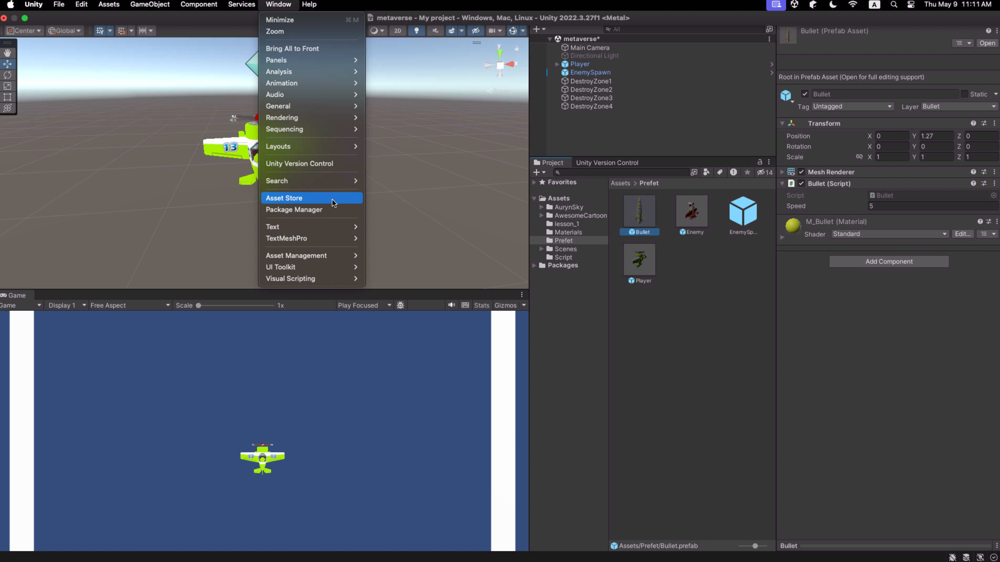
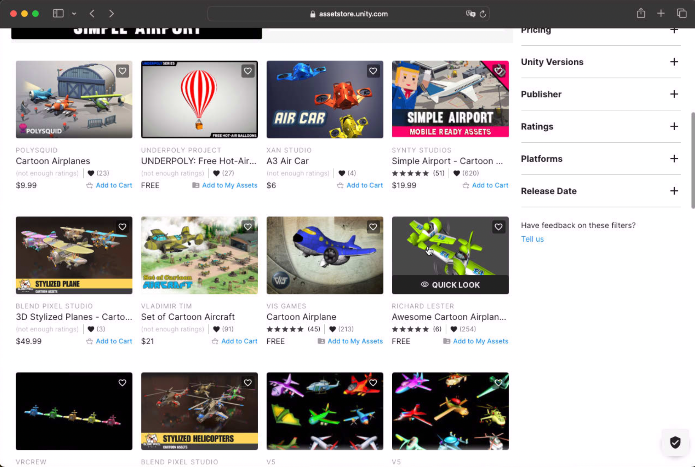
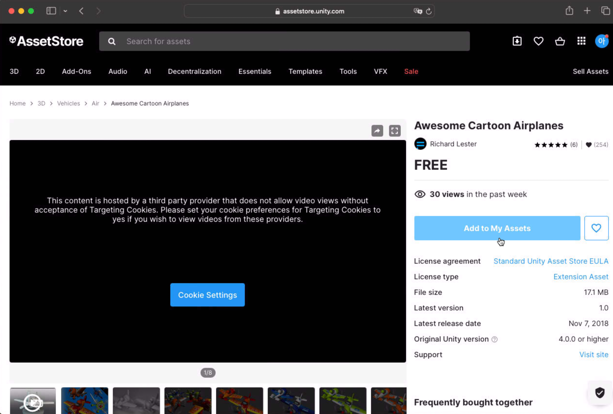
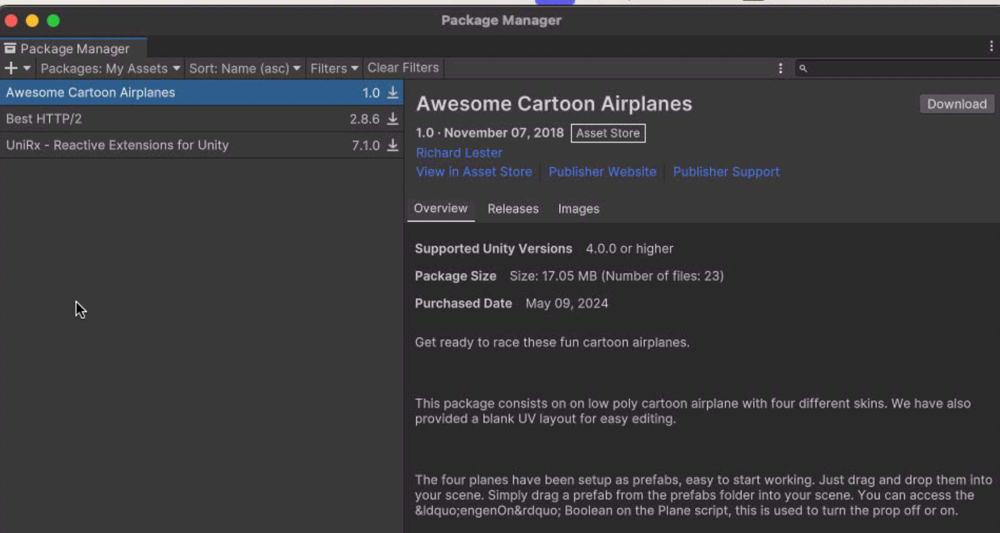
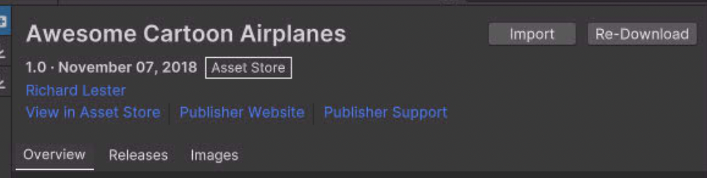
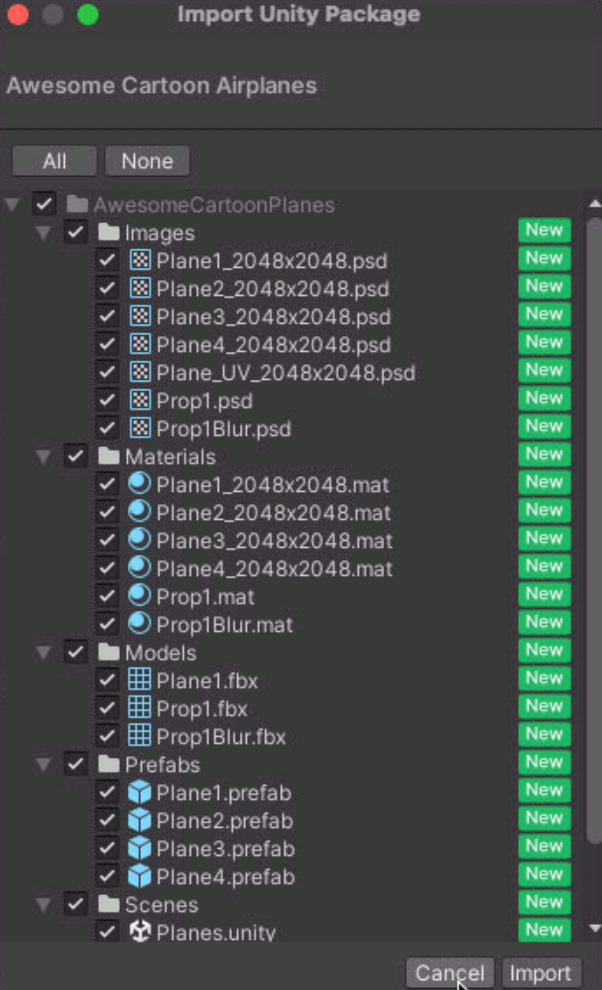
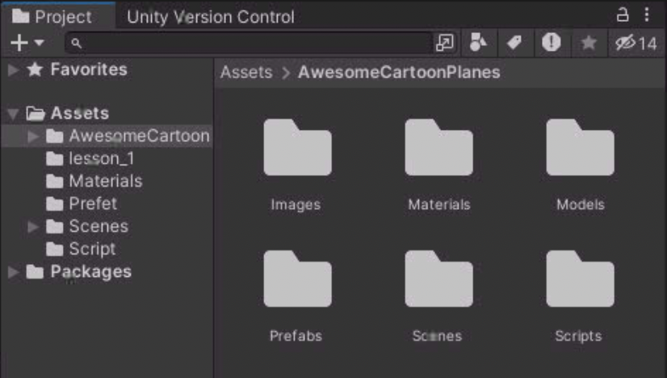
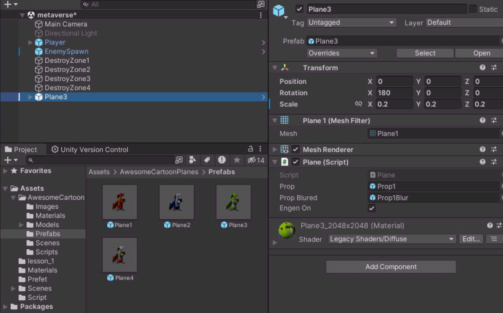

Asset Store?

유니티 사용자들이 자신이 만든 모델들을 공유하는 공간이다.\
무료도 있으며 사용하고 싶은 asset을 다운받아 내 프로젝트에 가져올 수 있다.

> [!WARNING]
> asset 에는 lisence가 있기에 함부로 재배포및 무단 사용을 하면 안된다.
> lisence를 잘 읽고 그에 따라 사용하는 것을 권장한다.

## asset 추가하기



```window``` -> ```asset store```를 선택한다.

| search | buy |
| --- | --- |
|  |  |

상위 화면처럼 마켓에서 원하는 항목을 검색하여 찾은다음 구매하여 사용할 수 있도록 만든다.\
그후 다운로드를 하여 unity를 돌아와보면\
다운로드한 목록을 볼 수 있다.



## asset import

| import | list | folder |
| --- | --- | --- |
|  |  |  |

임포트를 하면 내 프로젝트안에 asset에 있는 파일들이 저장된다.\
이제 원하는 부분의 모델들을 가져와 내 프로젝트에서 사용이 가능하다.

