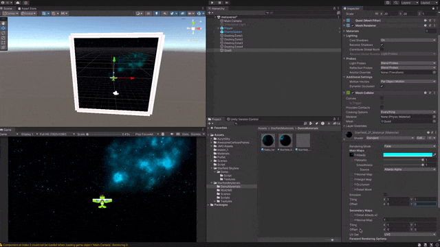
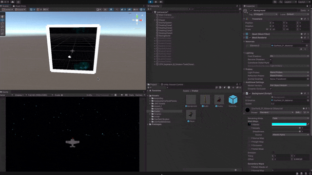

background를 움직이게 만들려면 만든 백그라운드에 offset 조정하는 것으로 움직임을 보이게 할 수 있다.



스크립트를 작성하여 프레임마다 offset이 이동하도록 설정하자

```c#
using System.Collections;
using System.Collections.Generic;
using UnityEngine;

public class Background : MonoBehaviour
{
    public Material BGmatrial;

    public float speed = 0.2f;
    
    // Start is called before the first frame update
    void Start()
    {
        
    }

    // Update is called once per frame
    void Update()
    {
        Vector2 diraction = Vector2.up;
        BGmatrial.mainTextureOffset += diraction * (speed * Time.deltaTime);
    }
}
```

상위에 y값이 증가하도록 설정을 해주고 


스크립트를 적용시켜주면



움직이는 배경을 볼 수  있다.

