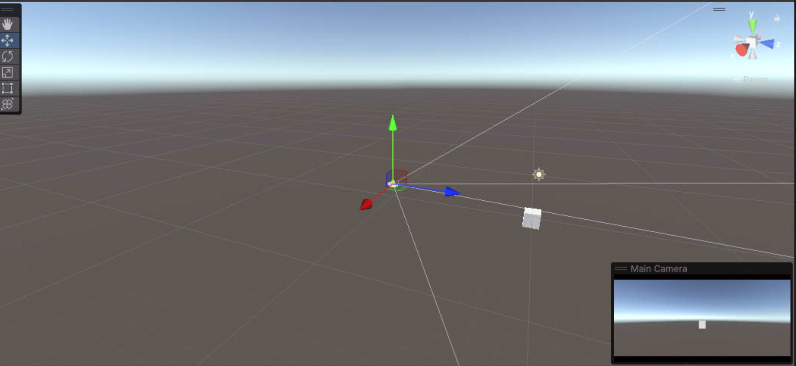

c# script에 기본적인 형태이다

```c#
using System.Collections;
using System.Collections.Generic;
using UnityEngine;

public class KeyBind : MonoBehaviour
{
    // Start is called before the first frame update
    void Start()
    {
        
    }

    // Update is called once per frame
    void Update()
    {
        
    }
}
```

## Start

스타트의 경우 처음 생성될때 한번 실행이 되어 오브젝트의 스타일 및 속성을 정의를 한다.

## Update

실행중 FPS(Frame Per Second) 한 프레임당 동작할 스크립트를 정의한다.\
최적화를 위해 고민하여 작성하는 것이 좋아보인다.

## public

아래와 같이 퍼블릭을 선언하여 ```Unity Engine``` 안에서 조작이 가능한 변수로 생성 할 수 있다.

```c#
public int speed;
```

## 스크립트 적용



스크립트의 경우 원하는 오브젝트에 스크립트 컴포넌트를 추가하여 작헝한 스크립트를 넣어주면 적용이된다.

예시 코드

```c#
using System.Collections;
using System.Collections.Generic;
using UnityEngine;

public class KeyBind : MonoBehaviour
{
    // Start is called before the first frame update
    void Start()
    {
        
    }

    // Update is called once per frame
    void Update()
    {
        transform.position = transform.position + Vector3.right * (5 * Time.deltaTime);
    }
}
```