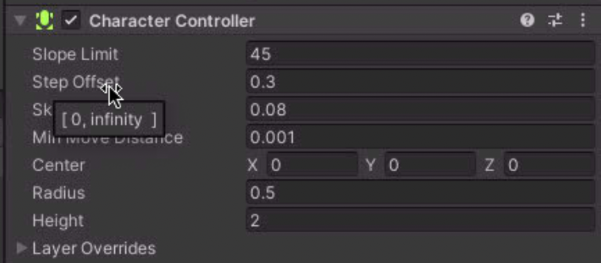
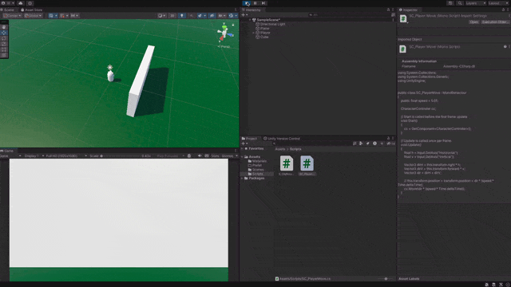

charatercontroller 는 unity에서 제공하는 편리한 케릭터에 대한 기능들을 제공한다



상위 컴포넌트를 추가한 이후 이 컴포넌트의 행동을 만들수 있다.

```c#
using System.Collections;
using System.Collections.Generic;
using UnityEngine;


public class SC_PlayerMove : MonoBehaviour
{
    public float speed = 5.0f;

    CharacterController cc;
    
    // Start is called before the first frame update
    void Start()
    {
        cc = GetComponent<CharacterController>();
    }

    // Update is called once per frame
    void Update()
    {
        float h = Input.GetAxis("Horizontal");
        float v = Input.GetAxis("Vertical");

        Vector3 dirH = this.transform.right * h;
        Vector3 dirV = this.transform.forward * v;
        Vector3 dir = dirH + dirV;

        // this.transform.position = transform.position + dir * (speed * Time.deltaTime);
        cc.Move(dir * (speed * Time.deltaTime));
    }
}
```

상위의 코드처럼 컴포넌트 가져와 움직임을 만들어 줄 수 있으며\
이러한 케릭터의 움직임은 충돌과 같은 작업들도 자동으로 해주기 때문에 훨신 편하게 작업을 할 수 있다.

