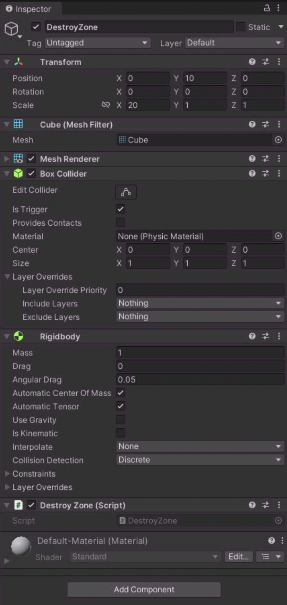
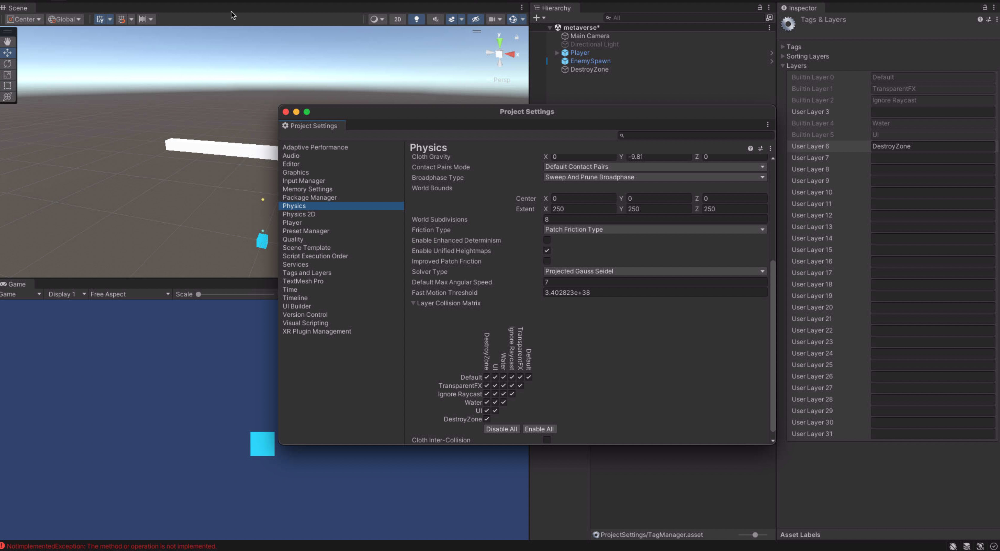

```c#
public class DestroyZone : MonoBehaviour
{
    private void OnTriggerEnter(Collider other)
    {
        throw new NotImplementedException();
    }
    
    private void OnTriggerStay(Collider other)
    {
        throw new NotImplementedException();
    }
    
    private void OnTriggerExit(Collider other)
    {
        throw new NotImplementedException();
    }

    private void OnCollisionEnter(Collision other)
    {
        throw new NotImplementedException();
    }

    private void OnCollisionStay(Collision other)
    {
        throw new NotImplementedException();
    }

    private void OnCollisionExit(Collision other)
    {
        throw new NotImplementedException();
    }
}
```

## OnTriggerEnter && OnCollisionEnter

부딪힐 때 발생하는 트리거 입니다.

## OnTriggerStay && OnCollisionStay

부딪히는 중일 때 작동하는 트리거 입니다.

## OnTriggerExit && OnCollisionExit

부딪힘이 끝났을때 발생하는 트리거 입니다.

## 충돌 설정



설정에 ```Box Collider```와  ```Rigidbody```를 설정할 수 있다.\
```collider```의경우 충돌설정이고 ```Rigidbody```의 경우 물리적 엔진을 작동하도록 처리해 준다.

## physics layout 설정



원하는 레이어 종류를 만들어 서로의 물리엔진을 상호작용을 할 것인지 선택할 수 있다.


점프를 하기 위한 간단한 스크립트다

```c#
rigidbody.AddForce(Vector3.up * jumpPower, ForceMode.Impulse);
print("jump");
```
와와 같이 방향과 옵션을 지정하면 ```rigidbody```에 힘을 줄 수 있다.

강체 힘 추가옵션아래와 같은 옵션들이 있다.

| mode | 설명 |
| --- | --- |
| Force | Add a continuous force to the rigidbody, using its mass.|
| Acceleration | Add a continuous acceleration to the rigidbody, ignoring its mass.|
| Impulse | Add an instant force impulse to the rigidbody, using its mass.|
| VelocityChange | Add an instant velocity change to the rigidbody, ignoring its mass.|


참고

[https://docs.unity3d.com/kr/current/ScriptReference/ForceMode.html](https://docs.unity3d.com/kr/current/ScriptReference/ForceMode.html)