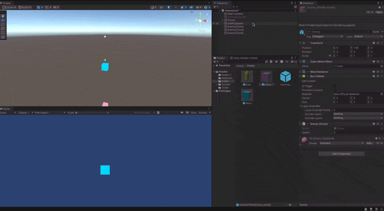
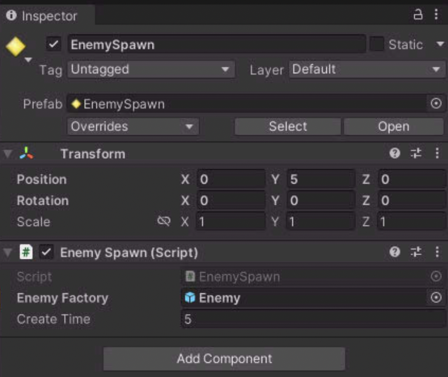

instantiate

인스턴스화 하여 새로운 오브젝트를 만드는 것을 해보자.



```c#
using System.Collections;
using System.Collections.Generic;
using UnityEngine;

public class EnemySpawn : MonoBehaviour
{
    public GameObject EnemyFactory;

    public float createTime = 5;
    private float currentTime = 0;
    // Start is called before the first frame update
    void Start()
    {
        
    }

    // Update is called once per frame
    void Update()
    {
        if (currentTime > createTime)
        {
            GameObject bullet = Instantiate(EnemyFactory);

            bullet.transform.position = this.transform.position;

            createTime = Random.Range(2.0f, 5.0f);
            currentTime = 0;
        }

        currentTime += Time.deltaTime;

    }
}
```

상위의 코드를 새로운 Empty 오브젝트에 넣어 일정 시간마다 생성되는 로직을 만들고\



EnemyFactory 에 원하는 오브젝트를 넣어 생성되게 한다.

