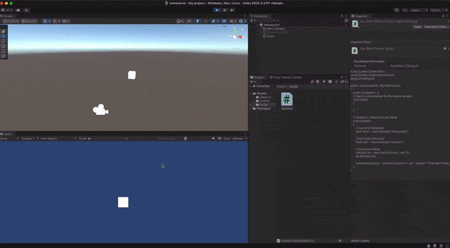
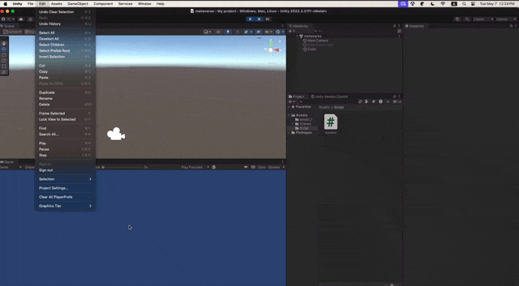

움직이는 큐브를 만들어 보자



## key mapping



```Edit``` -> ```Project Settings``` ->  ```Input Manager``` 을 선택하여 원하는 keybind 설정 및 기본 값을 확인 가능하다.

## keybind 가져오기

```c#
using System.Collections;
using System.Collections.Generic;
using UnityEngine;

public class KeyBind : MonoBehaviour
{
    public int speed = 5;
    // Start is called before the first frame update
    void Start()
    {
        
    }

    // Update is called once per frame
    void Update()
    {
        // key bind Horizontal
        float horiz = Input.GetAxis("Horizontal");
        
        // key bind Horizontal
        float vert = Input.GetAxis("Vertical");

        // direction setting
        Vector3 dir = new Vector3(horiz, vert, 0);
        dir.Normalize();
        
        transform.position = transform.position + dir * (speed * Time.deltaTime);
    }
}
```

```Input``` 함수를 사용하여 정의한 키를 가져올 수 있으며 사용 방법은 상위 코드와 같다.

