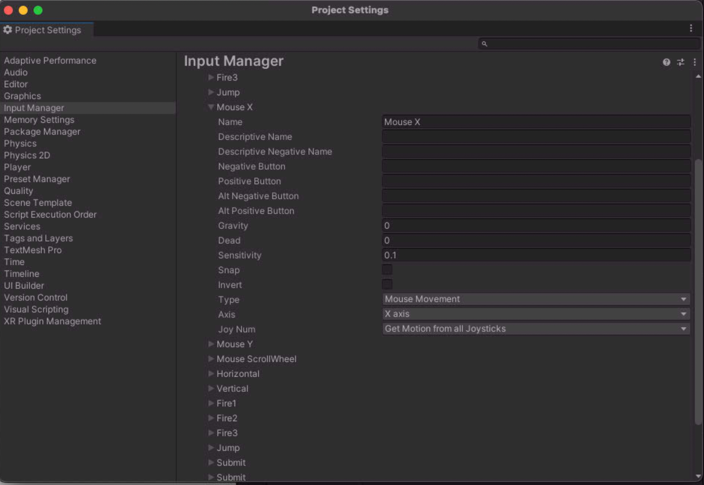
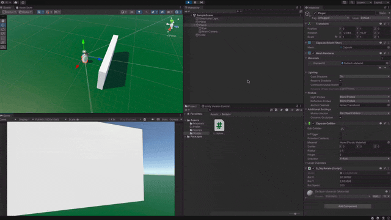

mouse ketbind를 하기위해서 먼저 프로젝트 세팅을 해준다



마우스 무브먼트를 받아와 값을 ```Mouse X```로 받아올 수 있게 되었다.

다음 스크립트를 작성하여 마우스와 상호작용하는 오브젝트를 만들어 보자

```c#
using System.Collections;
using System.Collections.Generic;
using UnityEngine;

public class S_ObjRotate : MonoBehaviour
{
    
    // variable of axis
    public float rotX = 0.0f;
    public float rotY = 0.0f;

    public float rotSpeed = 200.0f;
    
    // Start is called before the first frame update
    void Start()
    {
        
    }

    // Update is called once per frame
    void Update()
    {
        // get mouse movemnet
        float mx = Input.GetAxis("Mouse X");
        float my = Input.GetAxis("Mouse Y");
        
        // accumulation mouse movement
        rotX += mx * Time.deltaTime * rotSpeed;
        rotY += my * Time.deltaTime * rotSpeed;

        transform.localEulerAngles = new Vector3(-rotY, rotX, 0);
    }
}
```

이후 테스트를 해보면 잘 작동하는것을 볼 수 있다.

