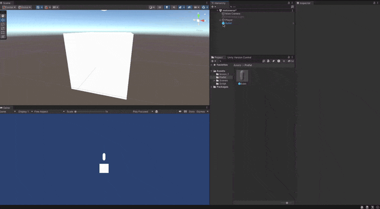

Prefab?

만들어진 오브젝트를 저장하여 같은 객체의 경우 clone을 생성하여 보다 빠르게 사용하려는 방식이다.\
```Hierarachy```에 오브젝트를 prefab으로 묶을수 있으며 저장된 파일은 하나의 묶음으로 존제한다.\
또한 프로젝트 안이 아닌 밖에서 파일을 불러오는 식으로 사용이 가능해 진다.



참조

https://docs.unity3d.com/kr/2021.3/Manual/CreatingPrefabs.html