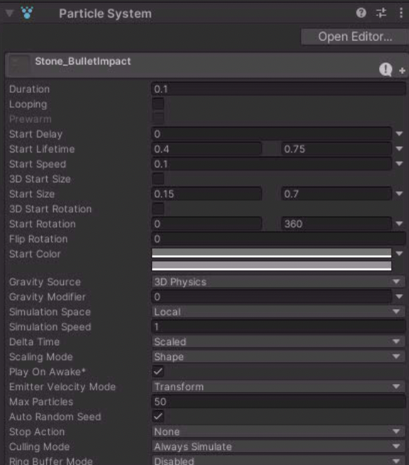

Ray

광선을 뜻하는 이 클레스는 물체와 충돌하는 정보를 가지고 있다.\
Ray를 이용하여 총을 사격하는 예시 코드를 살펴보자

```c# 
if (Input.GetMouseButton(0))
{
    Ray ray = new Ray(Camera.main.transform.position, Camera.main.transform.forward);
    RaycastHit hitinfo = new RaycastHit();
    if (Physics.Raycast(ray, out hitinfo))
    {
        // Debug.Log("hit Object" + hitinfo.transform.name);
        GameObject bulletEffect = Instantiate(bulletimpactFactory);
        
        bulletEffect.transform.position = hitinfo.point;
        bulletEffect.transform.forward = hitinfo.normal;
        Destroy(bulletEffect, 2);
}
}
```

상위 처럼 ```particle effect```를 만들어 카메라 방향에 총이 충돌하는 이팩트를 생성해 보았다.\
이러한 방법으로 직선의 어떠한 물체와 어디에서 어느 각도로 반사되는지 알 수 있다.

> [!TIP]
> 파티클을 생성할때 효과를 내고 싶으면 아래 ```play on awake``` 옵션을 켜주길 바란다


