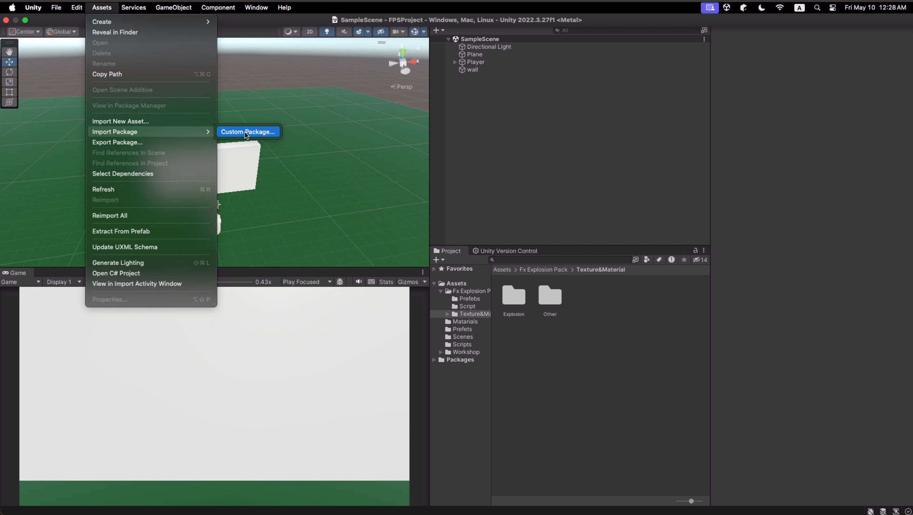
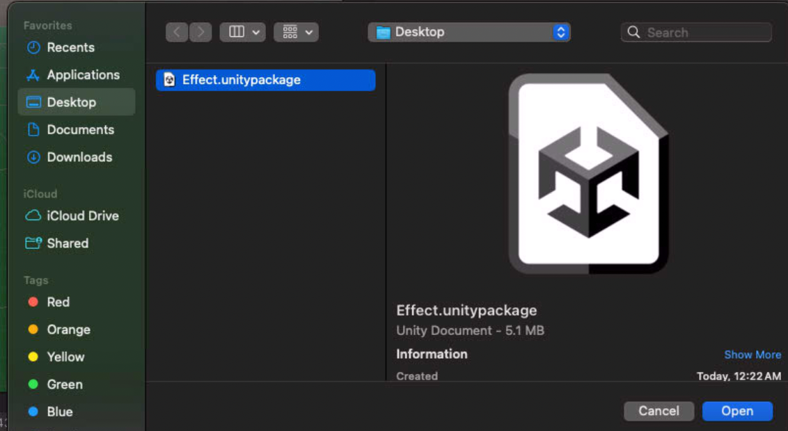
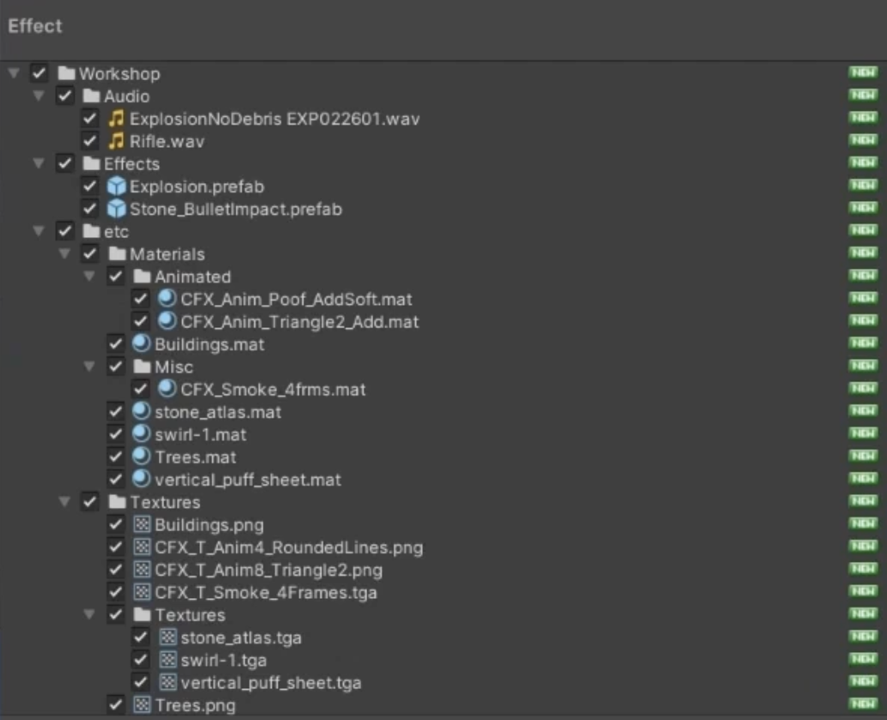
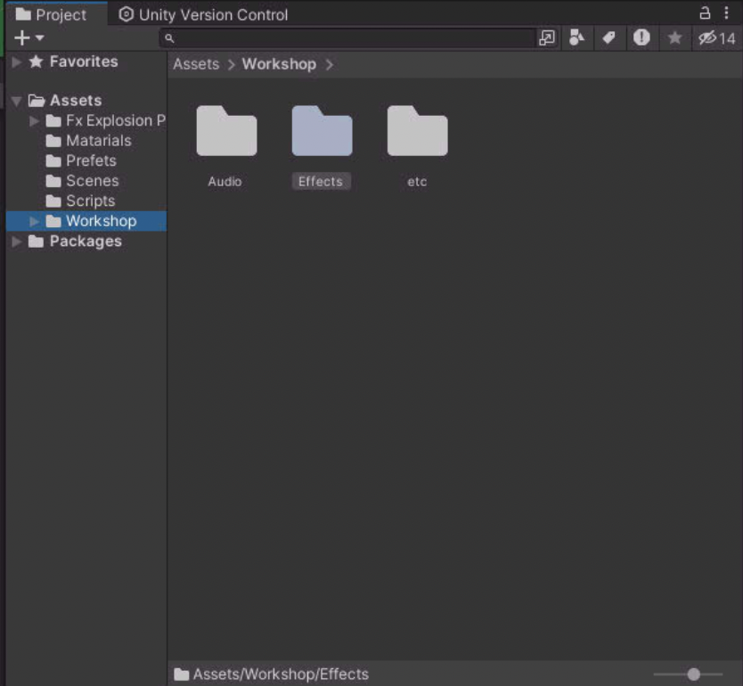

```import``` ?

패키지 형식으로 내보넨 asset들을 가져오는 행동이다.\
이러한 import를 사용함으로 다른이가 작업한 오브젝트들을 공유 할 수 있다.

| package import | select | list |
| --- | --- | --- |
| |  |  |

상위 단계처럼 내가 받은 package를 선택을 하여 원하는 목록을 불러와주면 된다.


