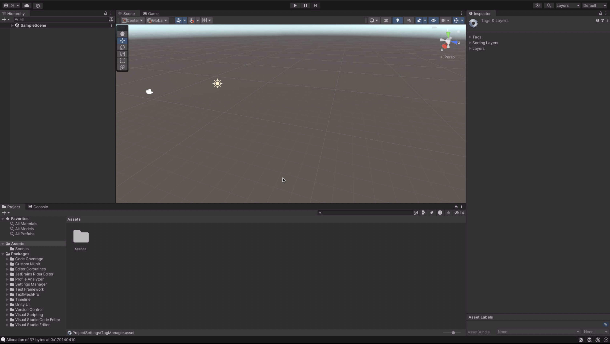
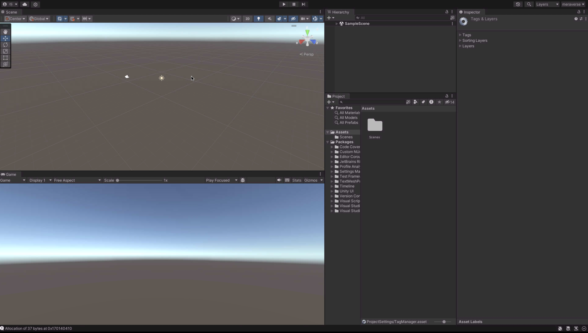
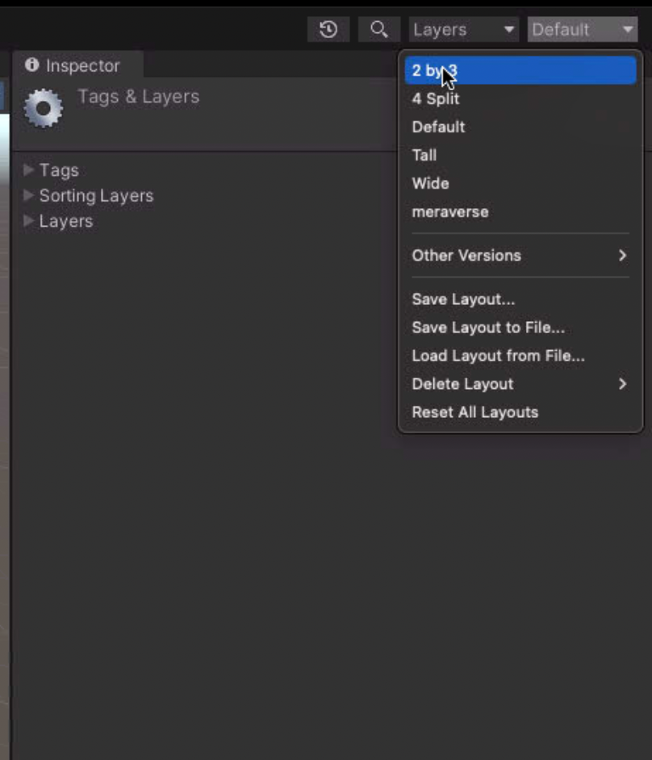

## layout 설정

| 변경전 | 변경후 |
| --- | --- |
|  |  |
오른쪽 상단의 ```Default```를 클릭하여 변경이 가능하다

또한 아래 세이브를 통하여 레이아웃 틀을 저장 할 수 있다.



## 화면제어

마우스 오른쪽 클릭을 이용한 움직임

> [!NOTE]
> 마우스 오른쪽 클릭을 홀드 한 후 키를 클릭해야 한다.

| 키 | 설명 |
| w | 앞 |
| s | 뒤 |
| a | 왼쪽 |
| d | 오른쪽 |
| e | 위 |
| q | 아래 |
| 마우스 휠 | 확대 축소 |

## Gizmo 3축

unity의 3축의 특징은 다음과 같다

| x | y | z |
| --- | --- | --- |
| 좌, 우 | 위, 아래 | 앞, 뒤 |


[gizmo image 추가하기]

# Hierarchy

컴포넌트를 관리하는 창이다.

```+```버튼을 눌러 오브젝트를 추가할 수 있다.

[엑터 추가 gif 추가하기]

## inspector

컴포넌트의 자세한 정보가 담겨 있다.

## Sence

작업을 하기 위한 기본적인 화면이다.\
트렌스폼 로테이션 등 다양한 조작을 기본적으로 이창에서 하며 level을 만들기 위한 용도이다.

오른쪽 상단에 조작 tool의 단축키는 q 부터 시작하여 오른쪽 방향으로 증가한다.
| 단축키 | 설명 |
| --- | --- |
| q | 화면 이동제어 |
| w | 위치 변경 |
| e | 회전 변경 |
| r | 스케일 변경|
| t | rect tool |
| y | 모든 변경 |

## Game

카메라의 위체에 대한 시각 이다.

플레이어의 기준에서 보는 역활을 하기위한 용도로 사용된다.