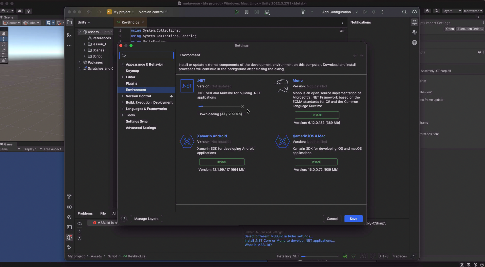

필자는 unity의 IDE 선택을 rider를 하였다.

세팅에 대한 설명을 진행하겠다.

먼저 유니티의 external tool 세팅을 ```Rider```로 변경 해준다.


이제 스크립트 파일을 하나 생성하여 실행해 보면 라이다로 연결되는것을 볼 수 있다.

```Rider```에 ```c#```을 사용하기 위하여 ```.Net```을 설치 해주어야한다.

```Setting``` -> ```Environment```에 들어가 설치를 해주자



그후 코드를 보면 정상적으로 라이브러리들이 불러와 지는 것을 볼 수 있다.

