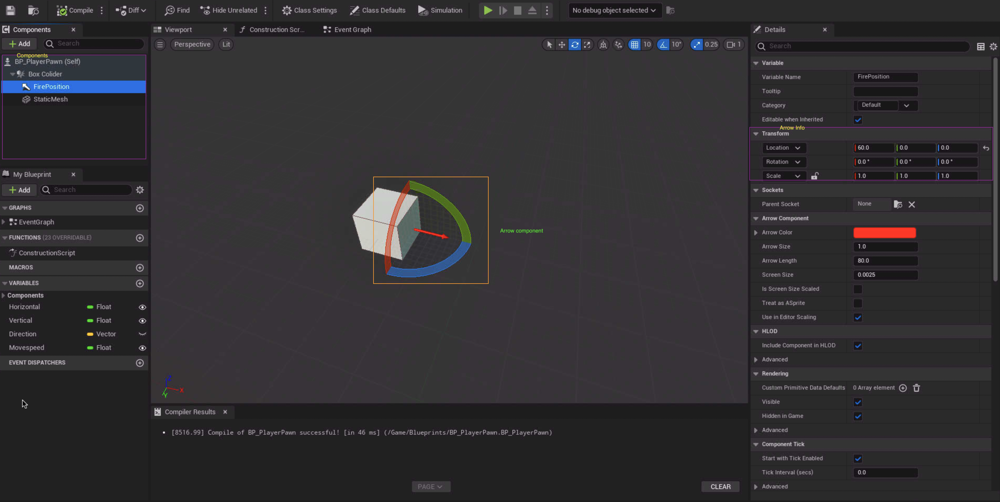
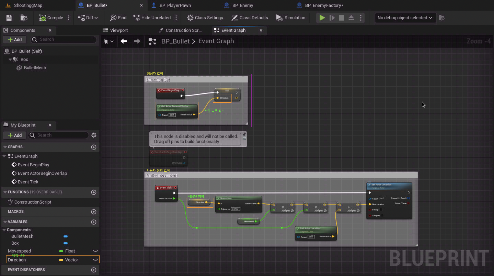
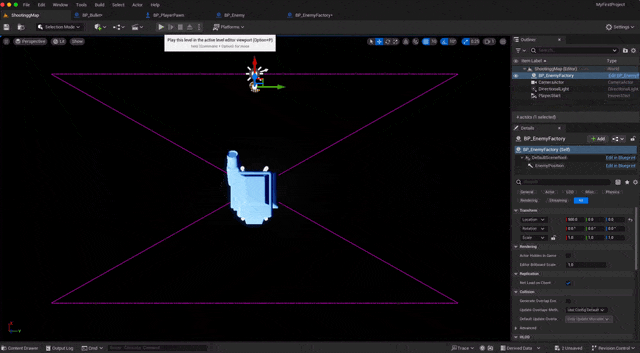

arrow 란?

블루 프린트에서 부모 객체에 대한 상대적 위치와 방향을 제공하는 정보이다.\
```arrow``` 정보를 가지고 움직임이 있어도 예상한 대로 결과를 만들기 위한 ```component```이다.

## Arrow create



## Arrow use


사용방법은 다음과 같다\
이러한 Arrow 정보를 다른 actor에 전달하여 정보를 줄 수 있고



상위 로직을 사용하여 새로 생성된 actor의 방향을 지정해 줄 수 있다.

