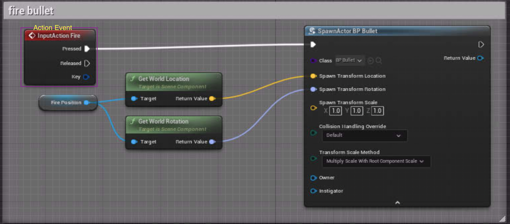
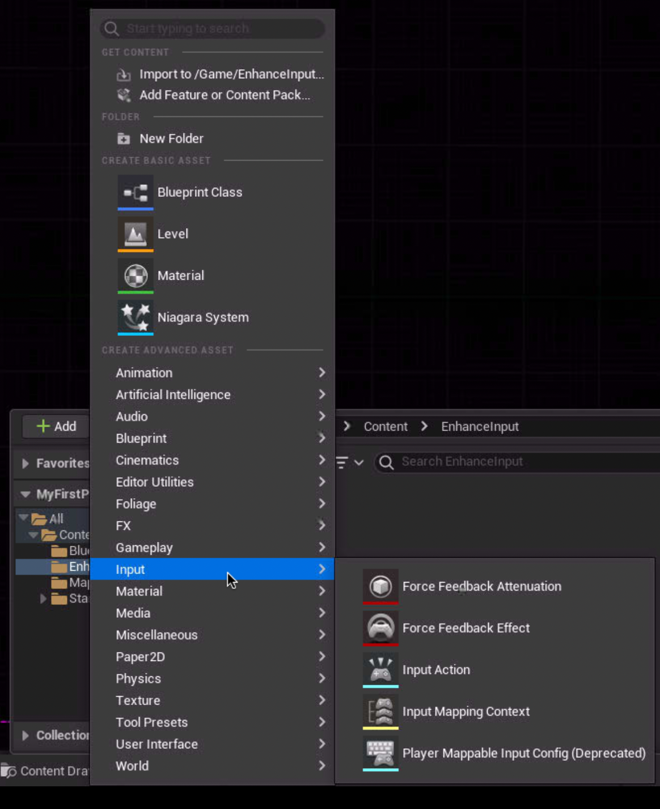
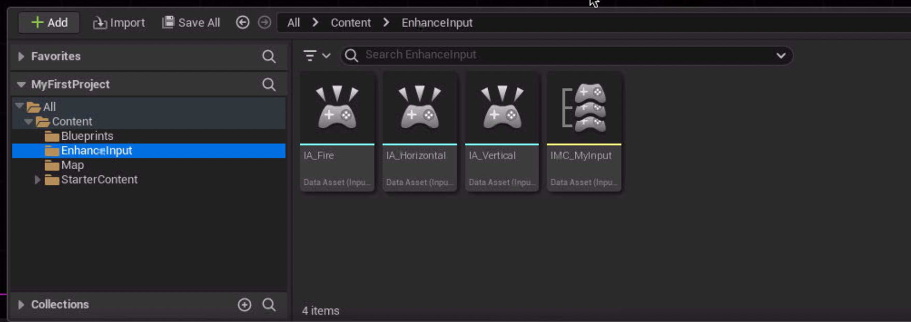
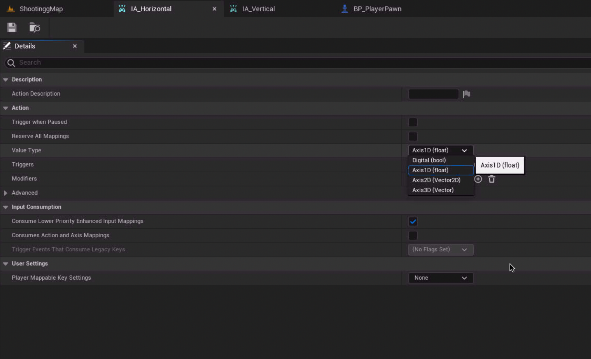
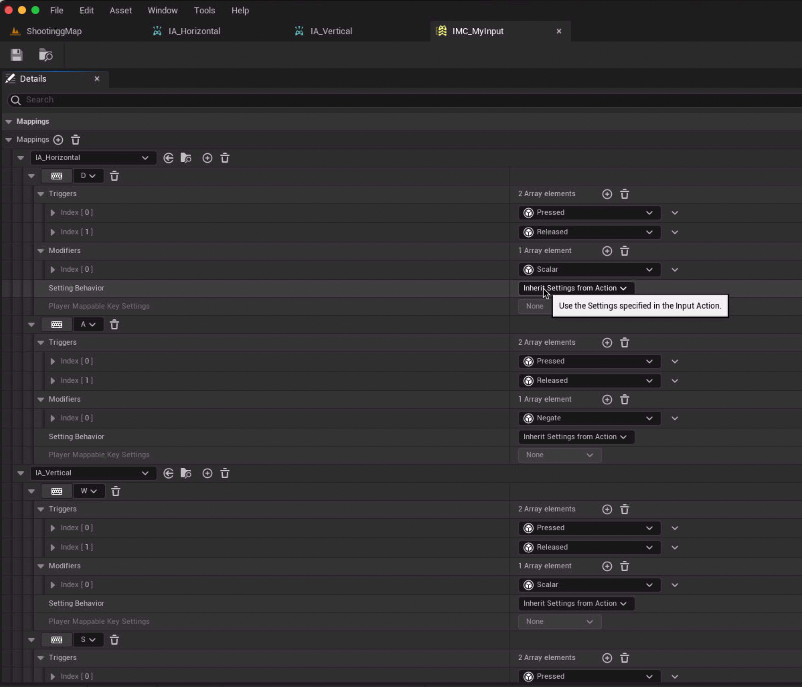
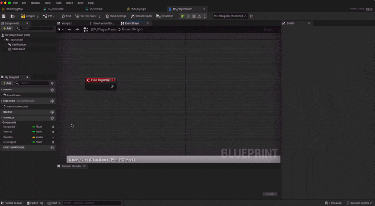
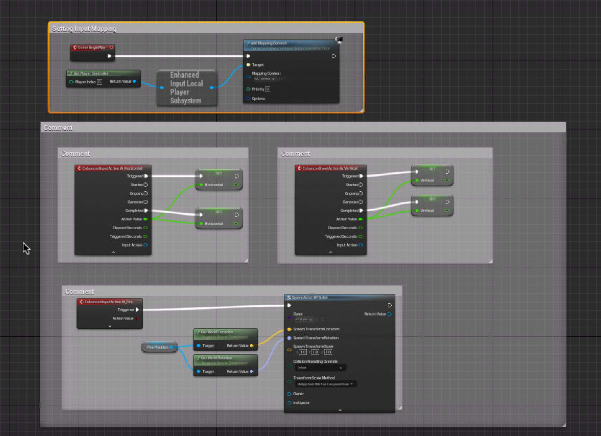

## input key binding 설정


input 메뉴의 keybind 설정이다

필요한 키를 눌러 키 이벤트를 생성하는 식으로 사용 가능하다.

## bind key 사용


상위 로직을 구연하는 것으로 이동하는 모습을 구연할 수 있다.



또한 action key 도 이러한 방식으로 키가 눌렸을때 반응을 할 수 있다.

> [!IMPORTANT]
> 추후 5.0 엔진에 맞는 keybind 설정을 작성하겠다. \
> 하위 내용이 새로운 키 방식이다 (update 2024.04.30)

## Enhanced Input

최신 버전의 input 컨트롤 하는 방법이다.\
좀더 직관적이며 여러가지 기능을 한번에 사용할 수 있어 좋다

### Enhanced Input 생성

| 생성 | 아이템 목록 |
|---|---|
|  |  |

상위 보는 봐와 같이 ```mapping``` 과 ```input action``` 부분이 둘로 나누어 져 있다\
엑션을 먼저 만들고 멥핑에 들어가 엑션에 대한 keybind를 설정 해주어야 한다.

| input action | mapping |
|---|---|
|  |  |

상위 설정을 하고 이제 ```input``` 을 받고 싶은  ```actor```에 적용하면 된다._createMdxContent

### Enhanced Input 사용

| mapping | input action |
|---|---|
|  |  |

맵핑을 불러와 설정을 하면 이제 멥에 있는 ```input action```들을 사용 할 수 있게 된다.\
하위 방법처럼 로직을 짜서 사용을 할 수 있으니 참고 바란다


