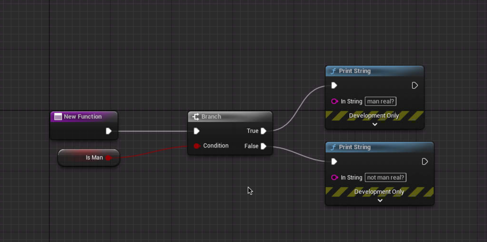
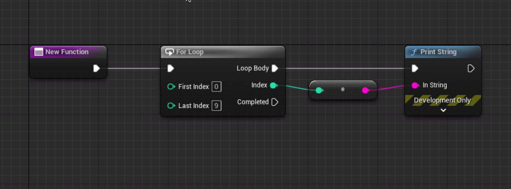

## Branch

if 문과 같은 기능을 한다 ```condition```의 값에 따라 다음 노드를 실행 시킨다.



## Forloop

반복문을 생성하는 노드이다.

조금식 다른 옵션들이 있으니 잘 보고 선택해야 한다.



## (비교, 논리,) 연산자

거의 대부분의 프로그램밍 언어와 같은 방식으로 검색하면 나오기 때문에 크게 걱정 할 필요없을겨 같다

