blueprint 란?

블루 프린트는 개발자가 만든 함수와 로직을 비개발자 입장에서 사용하기 편하게 노드 식으로 만들어 주는 것이다.\
필요한 로직을 만들어 디자이너 혹은 기획자가 사용할 수 있게 설명과 예시 노드를 만들어 주는 것이 좋아 보인다.

## 노드의 특징

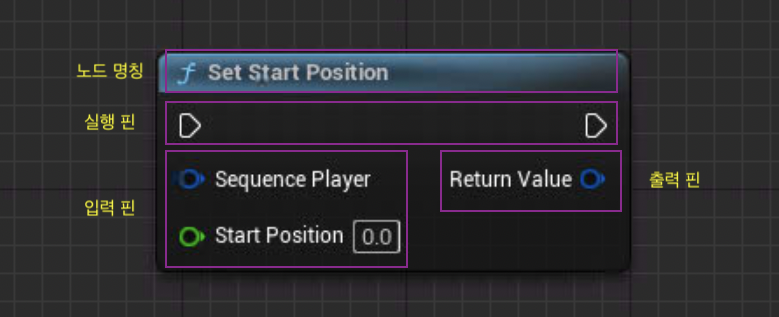

| 컨트롤 | 효과 |
| --- | --- |
| 노드 명칭 | 오른쪽 클릭으로 내가만든 함수의 명칠을 찾아 불러올 수 있다. |
| 실행 핀 | 실행한는 조건을 줄수 있다. (파이프 라인) |
| 입력 핀 | 노드에 필요한 인풋 값을 가질 수 있다. |
| 출력 핀 | 노드 결과를 반환한 값을 사용 할 수 있다. |

상위의 구조를 가지고 있고 필요에 따라 노드를 이어주는 식으로 사용이 가능하다.

예시

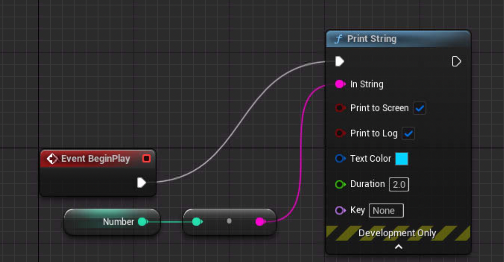

## Viewport 컨트롤

마우스로 

| 컨트롤 | 효과 |
| --- | --- |
| 마우스 오른쪽 | viewport를 이동할 수 있다 |
| 마우스 휠 | 확대 및 축소를 할 수 있다. |
| 마우스 드레그 | 노드들을 선택할 수 있다. |

## Interface

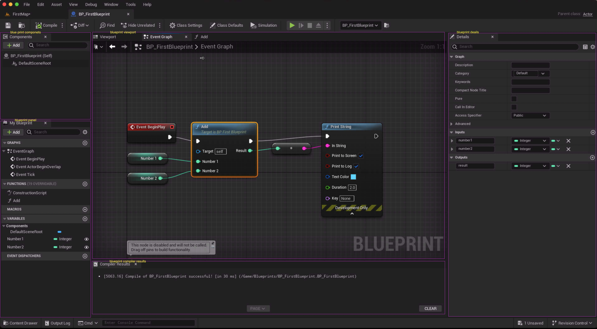

| 명칭 | 설명 |
| --- | --- |
| blueprint componets | 블루프린트 목록을 볼 수 있다. |
| blueprint panel | 추가한 블루프린트의 요소들을 볼 수 있다. |
| blueprint viewport | 블루프린트의 설정 및 조작을 힐 수 있다. |
| blueprint compiler results | 컴파일 결과를 볼 수 있다. |
| blueprint deails | 자세한 사항을 볼 수 있다. |

## Craete

| 파일 생성 | 이름 지정 | blueprint viewport 접속 | 
| --- |--- | --- |
| 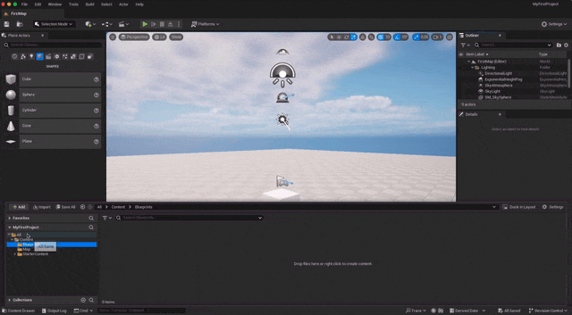 | 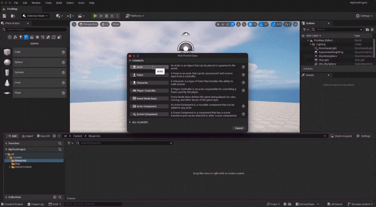 | 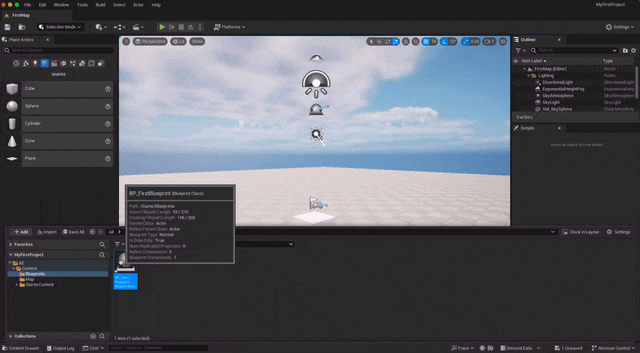 |

blueprint는 파일로 관리되어 필요시 다른 프로젝트 에서도 사용이 가능하다.

## Variable

| 생성 | 사용 |
| --- | --- |
| 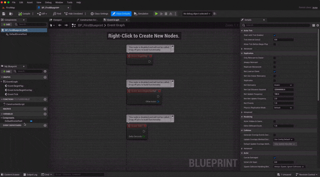 | 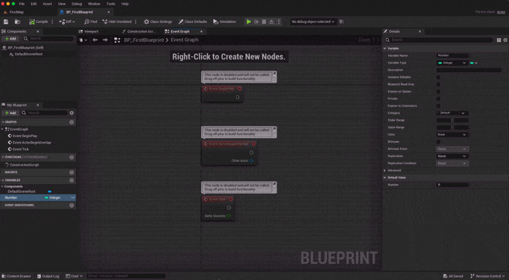 |

변수를 생성하여 노드로 사용할 수 있다.

타입을 고려하여 필요한 형식을 만들어 적절히 추가하는 것이 좋다.

## Function

| 생성 | 사용 |
| --- | --- |
| 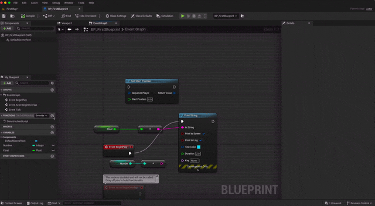 | 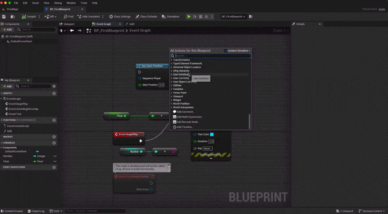 |

함수를 만들어 노드로 사용할 수 있다.

인풋과 아웃풋을 고려하여 적절한 로직을 짜 생성하는 것을 추천한다.

## Level Viewport에 Blueprint 추가

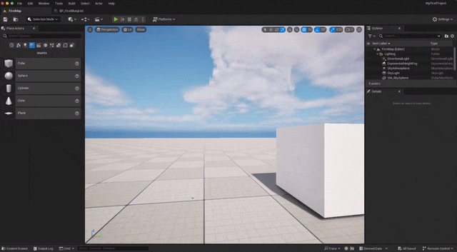

level viewport 에 적용하는 방법은 생성한 블루 프린트를 넣어 주는것으로 동작한다.

> [!WARNING]
> 꼭 컴파일과 저장을 하고 추가하길 바란다.

## Editalble 설정

블루프린트의 값을 외부에서 설정 할 수 있게 하려면 Editalble을 켜주면 된다.

| Editalble 허가 | Editalble 설정 |
| --- | --- |
| 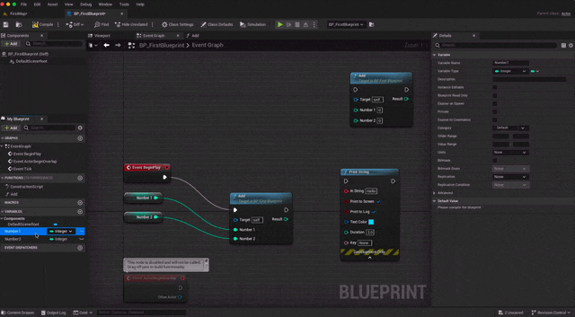 | 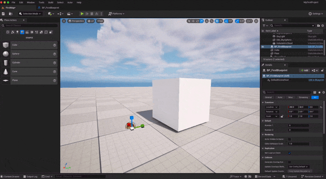 

## 참조

https://dev.epicgames.com/documentation/en-us/unreal-engine/user-interface-components-in-unreal-engine

