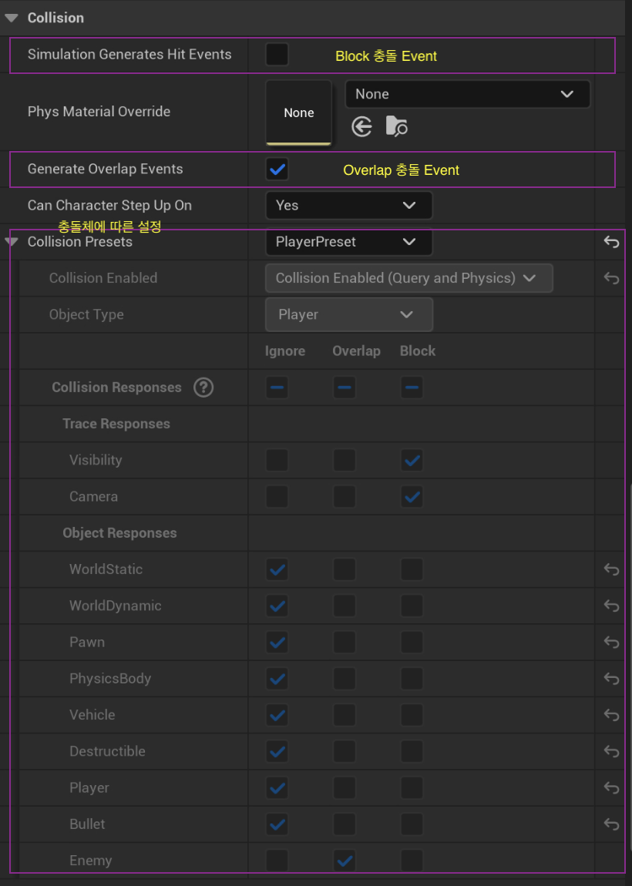
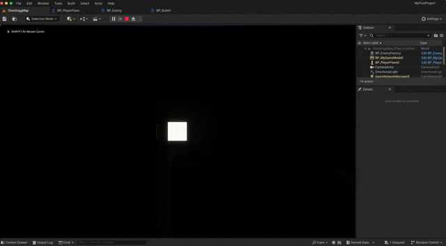
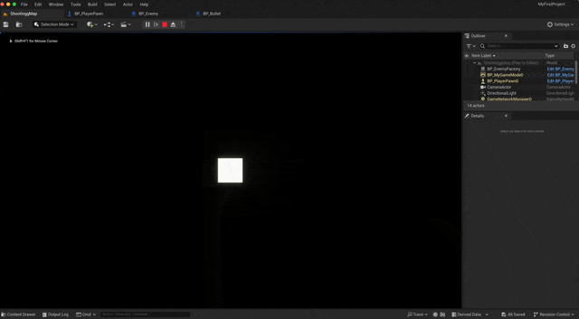
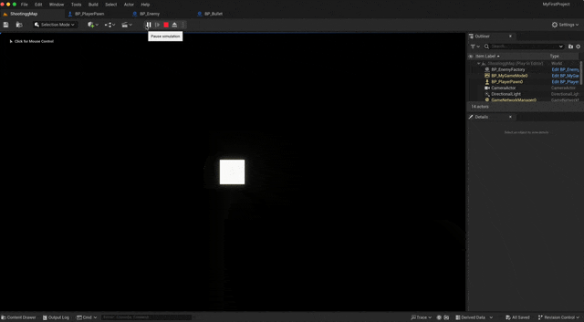
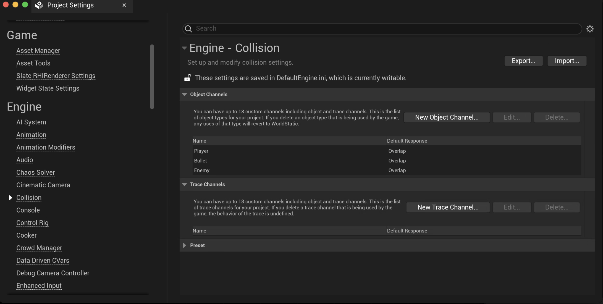
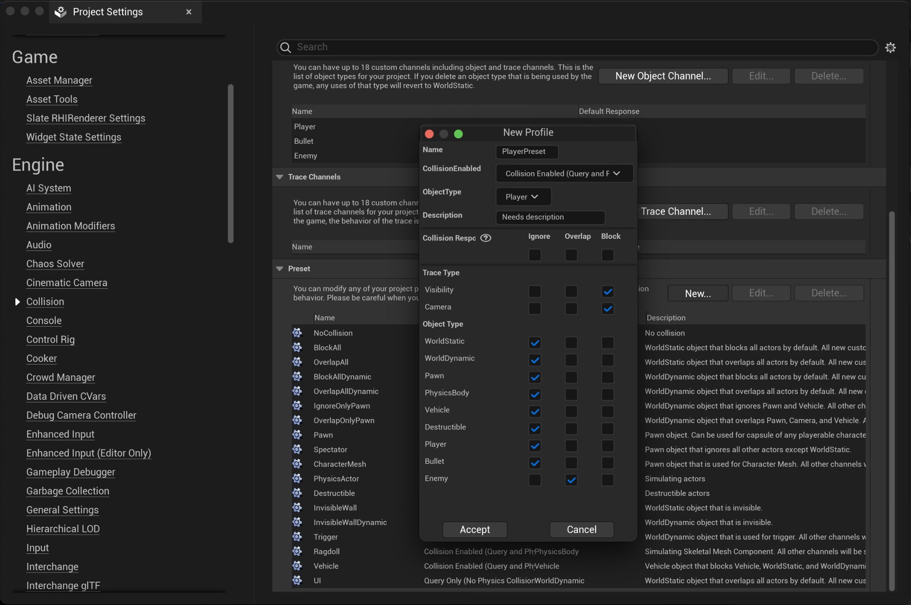
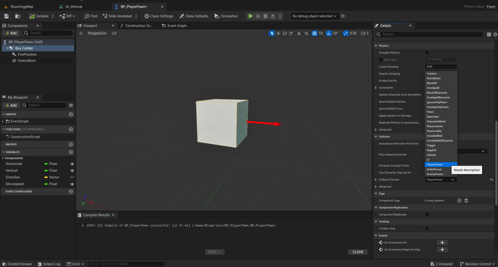
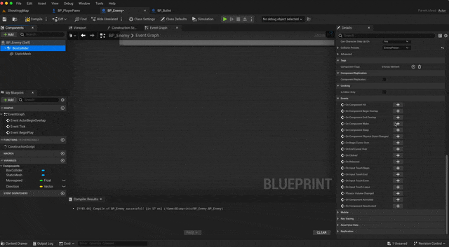
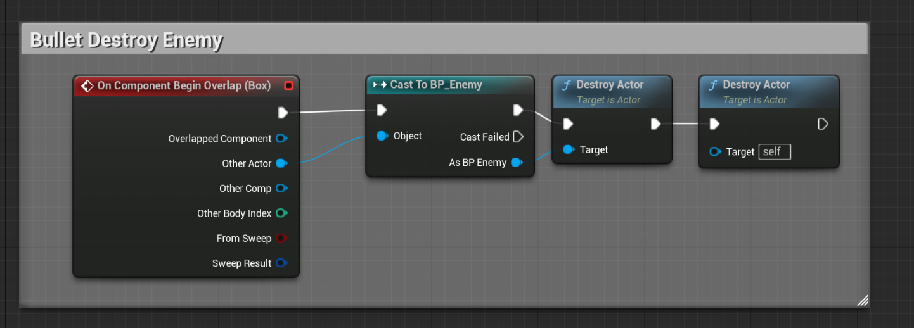

Collision 란?



충돌 처리를 담당하는 기능이다.\
상위와 같이 3가지의 설정을 할 수 있으며 그에 따른 엑터에 상호작용 기능을 부여한다.

| 옵션 | 설명 | 이미지 |
| --- | --- | --- |
| Ignore | 상효작용 안함 | 
| Overlap | 충돌시 이벤트 생성 하는 상용작용 | 
| Block | 충돌시 막히며 이벤트를 생성 하는 상호작용 | 


collision 층돌 처리를 하기 위해 몇가지 사전 준비가 필요하다.

## Collider Setting

| 충돌체 정의 | 프리셋 만들기 |
|---|---|
|  |  |

상위 처럼 특정한 충돌체 상호작오을 정의 하여 동일하게 여러 엑터에 설정을 해줄 수 있다.



## Collider Use

사용을 하기위해서는 생성한 ```Collider```를 선택하여 ```detail panel```에서 원하는 함수를 추가해야 한다.



하위 코드는 충돌 예시 코드이다



