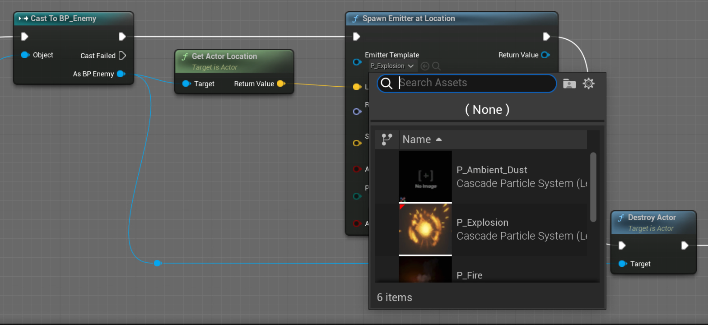
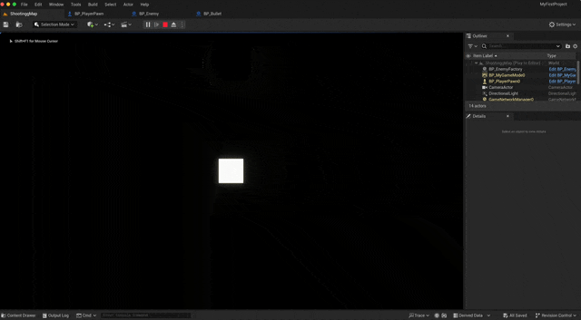
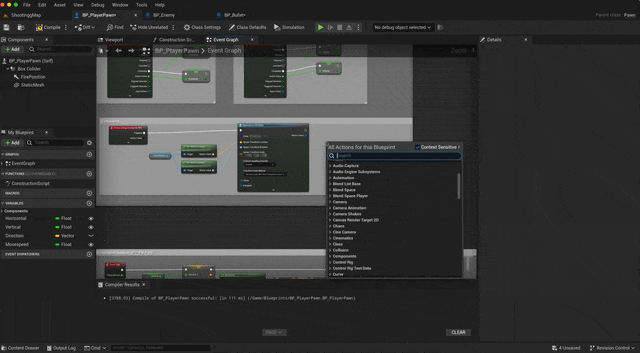

Effect 생성

effect는 간단하게 어떠한 실행 다음에 이어주면 된다.\
추가적으로 새로운 효과를 생성하여 넣어 주었을 경우 검색창에서 확인이 가능하며 사용 할 수 있다.

사운드 effect 또한 동일한 방법을 세팅이 가능하다

> [!WARNING]
> mp3 파일의 경우 여러 종류가 있기 때문에 wav 확장자로 변형 하는것을 추천 한다고 한다.
