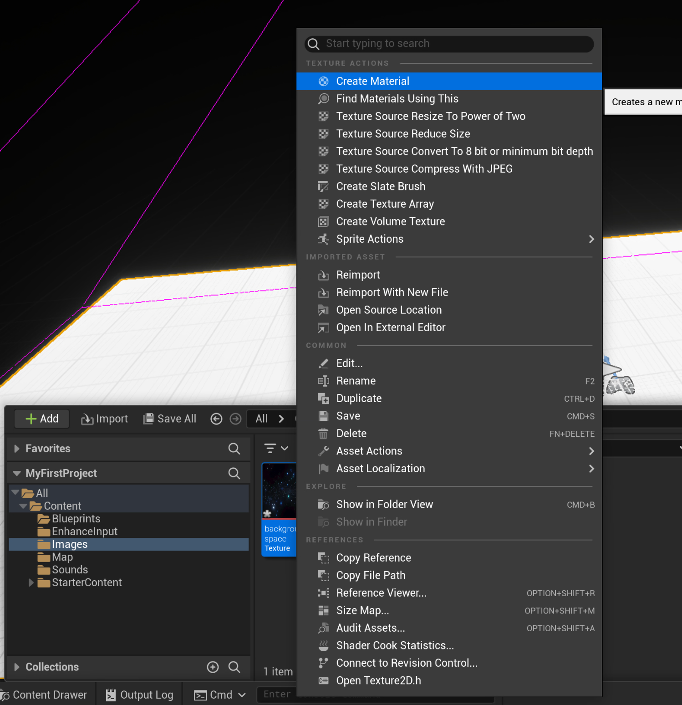
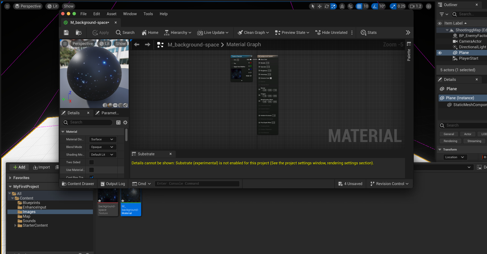
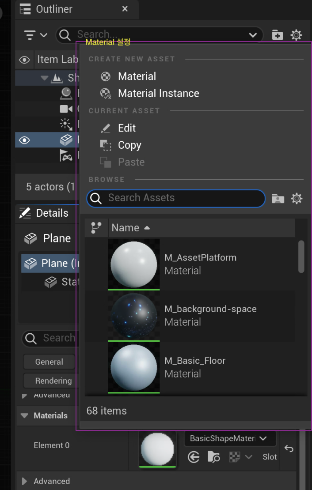
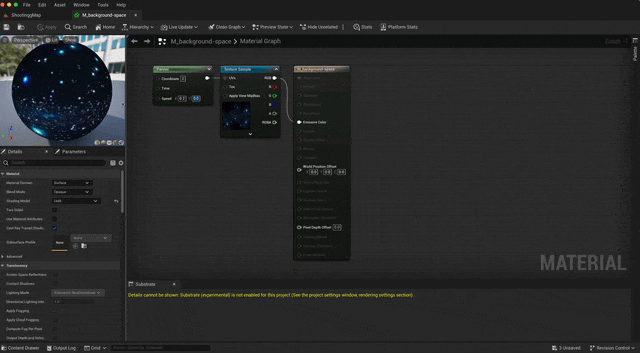
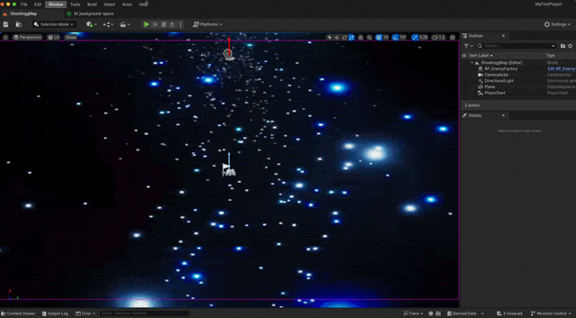
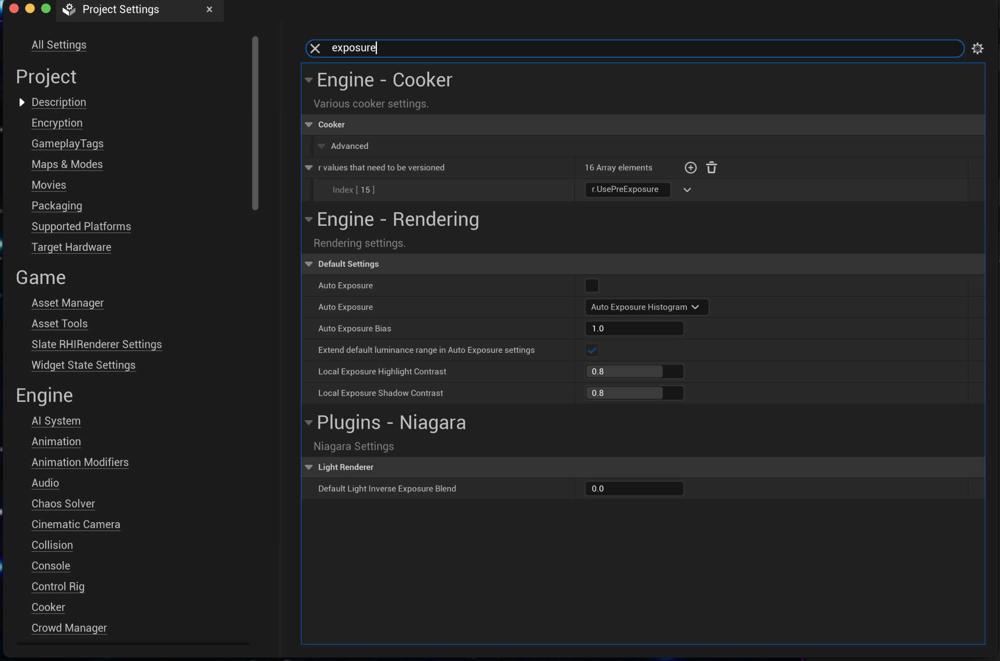

Material 란?

제질을 말하며 이러한 제질을 외부에서 가져옴으로서 좀더 디테일한 효과를 보여줄 수 있다.

## Material 생성

| material create | material info |
| --- | --- |
|  |  |

상위 처럼 제질을 가져와 넣어 줄 수 있으며 내부 속성을 확인하여 내가 원하는 방식의 제질을 만들어 줄 수 있다._createMdxContent

## Actor에 Material 적용

| 이미지 | 설명 |
| --- | --- |
| | 원하는 actor를 선택하여 알맞는 material 설정 |

오른쪽 Material 옵션에서 내가 원하는 제질을 선택한다음 생성하면 된다.

| info | view |
| --- | --- |
|  |  |

> [!TIP]
>  \
> 화면이 밝아지는 현상은 빛 적응 효과 때문에 그렇다 이러한 옴션을 꺼주어 본래 색을 볼 수 있다.