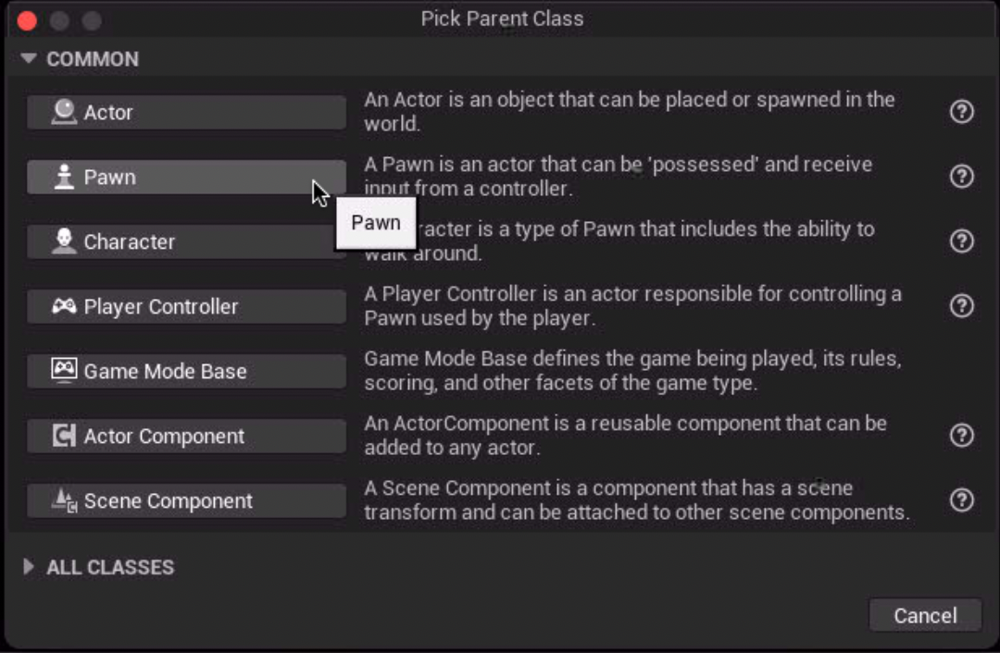
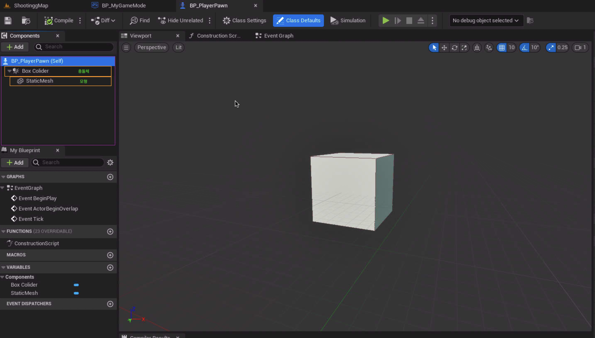
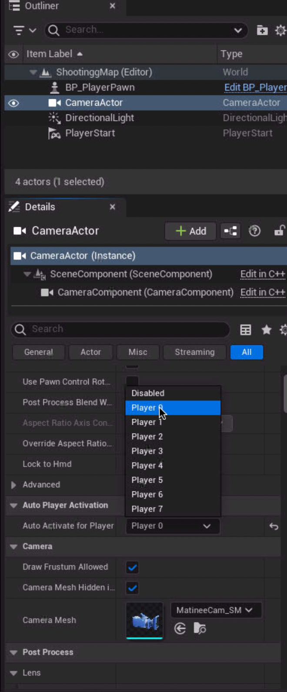
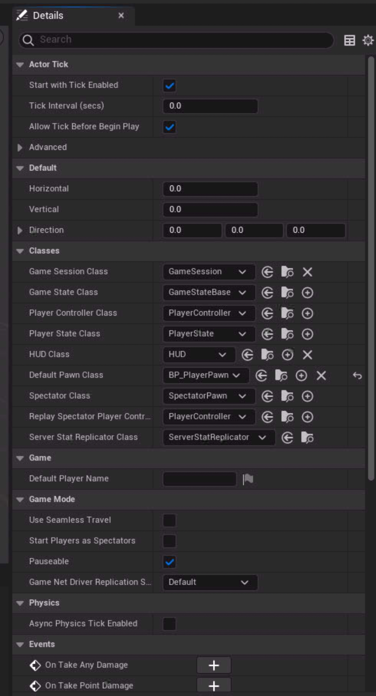
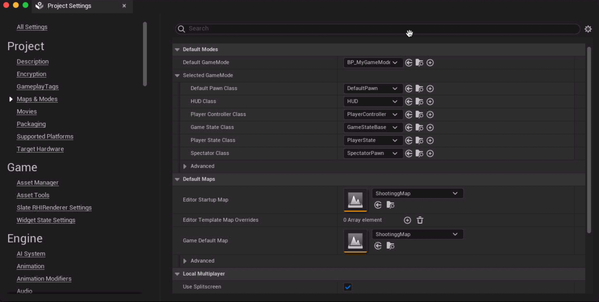
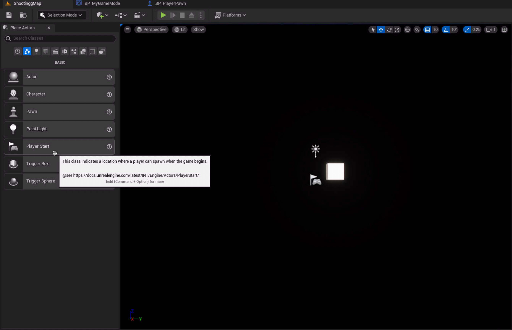

## player blueprint 생성



pawn 을 생성하여 사용자 정의의 플레이어를 집접 만들어 사용한다.

## player 생성



mesh(모형) 및 Colider(충돌체) 생성

상호 작용하는 물체를 만들기 위해서는 ```Colider``` 설정이 필요하며 그에 맞는 ```mesh```를 설정하여 시각적으로 보이게 하는 것이 필요하다.

## player setting

| camera | gamemode | project setting |
| --- | --- | --- |
|   |  |  |

플레이어와 상호작용하기 위한 설정

camera : 플레이어를 바라본다. player0 이 시작을 하는 유저를 가르킨다\
gamemode : 만든 플레이어를 player start로 설정한다.
project : 케릭터를 설정한다.

## player start



플레이어 스타트를 새팅하여 
