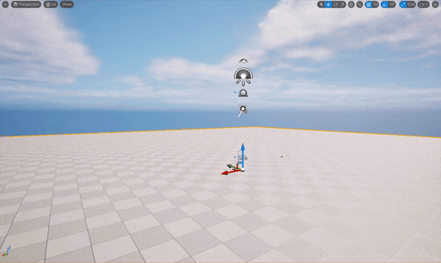
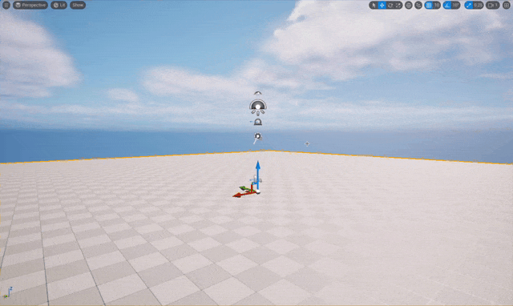

level viewport 에서 움직이는 방법

## 마우스를 왼쪽 클릭을 이용한 움직임

왼쪽을 클릭하고 마우스를 움직여 내가 보는 카메라를 움직일 수 있다.\

| 이동 | 효과 |
| --- | --- |
| 마우스 상 | 앞으로 전진한다 |
| 마우스 하 | 뒤로 후진한다 |
| 마우스 좌 | 왼쪽으로 돌린다 |
| 마우스 우 | 오른쪽으로 돌린다 |

## 마우스를 오른쪽 클릭을 이용한 움직임

마우스 오른쪽을 클릭하고 원하는 방항으로 카메라 회전이 가능하며\
이동키를 이용하여 움직일 수 있다.

| 이동 | 효과 |
| --- | --- |
| 마우스 상 | 위로 회전 |
| 마우스 하 | 아래로 회전 |
| 마우스 좌 | 좌로 회전 |
| 마우스 우 | 우로 회전 |
| w | 앞으로 전진한다 |
| s | 뒤로 후진한다 |
| a | 왼쪽으로 돌린다 |
| d | 오른쪽으로 돌린다 |