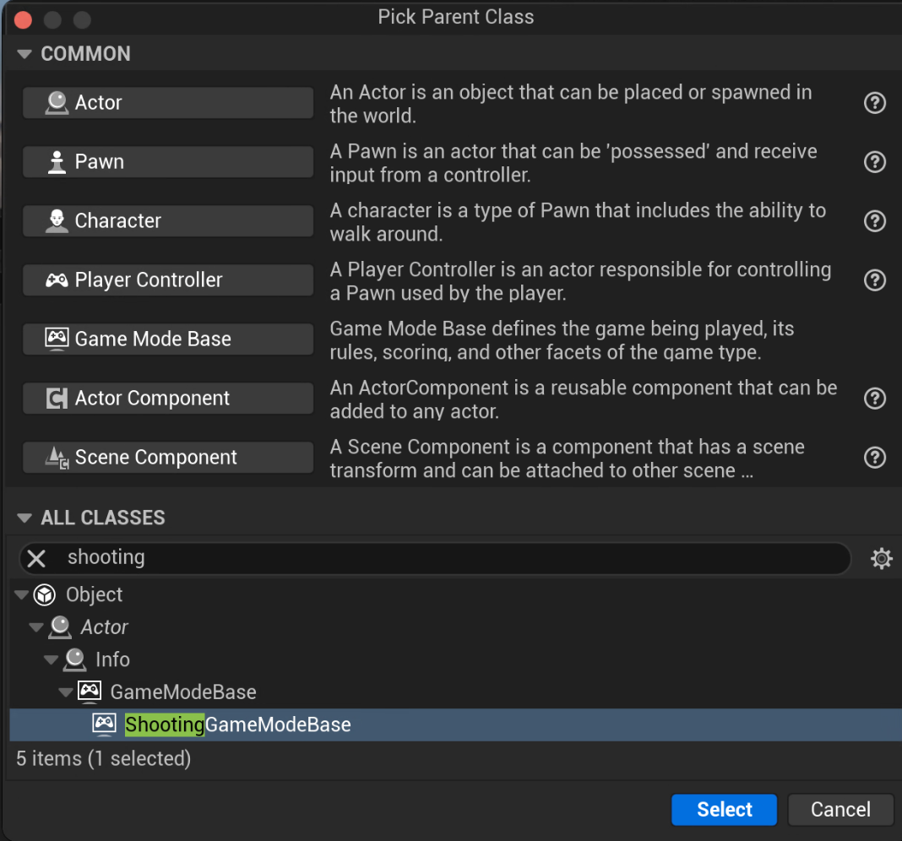
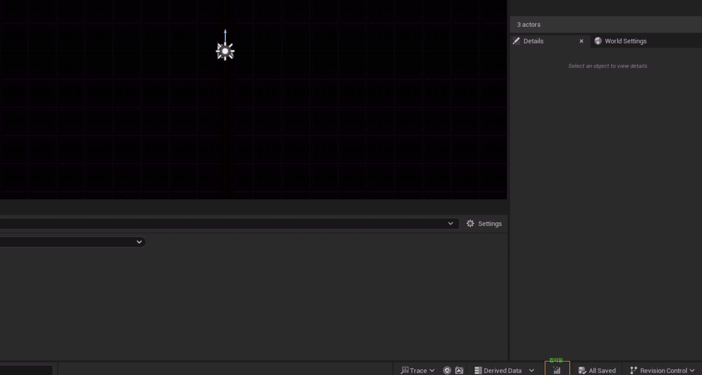

blueprint로 상속하는 방법은 다음과 같다.

```blueprint class```를 add하고 아래 클레스에서 내가 만츤 cpp class를 추가해준다.



그렇게 만들어진 블루프린트는 ```c++ class```의 클론으로 생성된다.

## 컴파일

코드를 수정한 이후 ```complie``` 을 해주는 것으로 수정을 적용 할 수 있다.



> [!WARNING]
> 수정이 안될경우 blueprint 를 우클릭한후 reaload를 선택하여 확인해본다.
