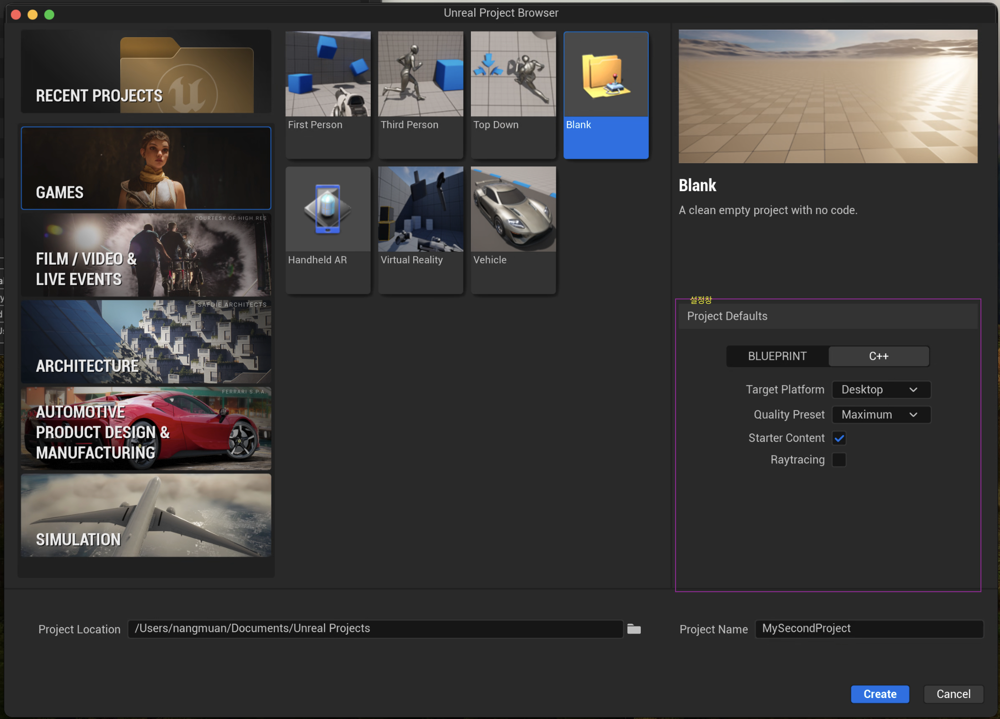
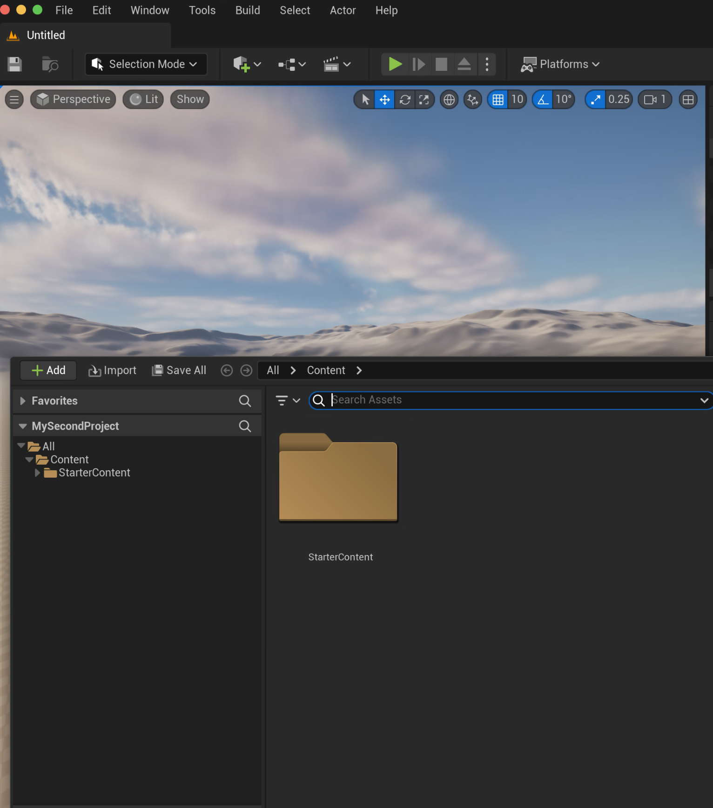
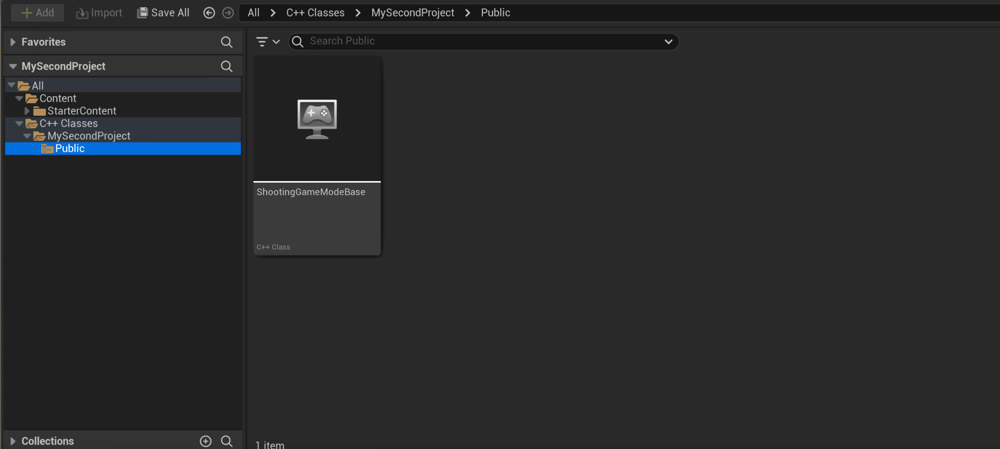
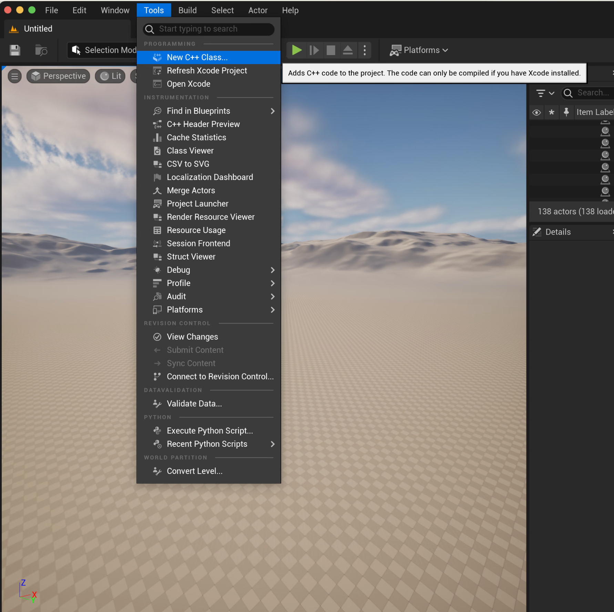
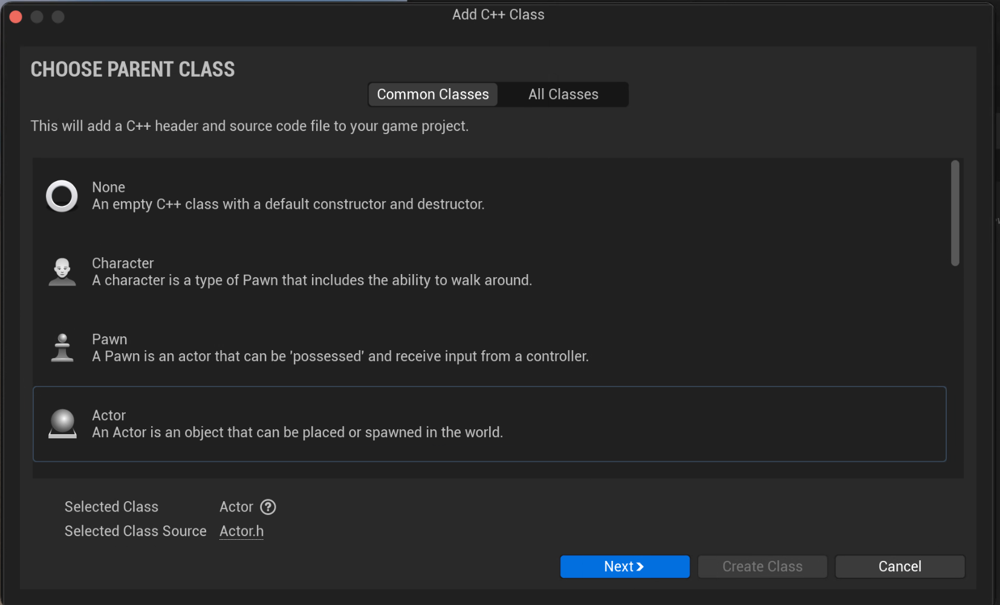
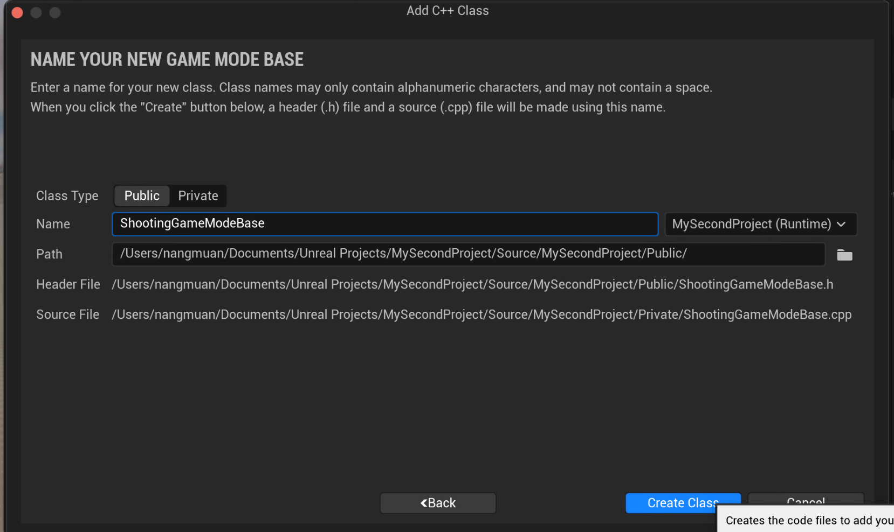
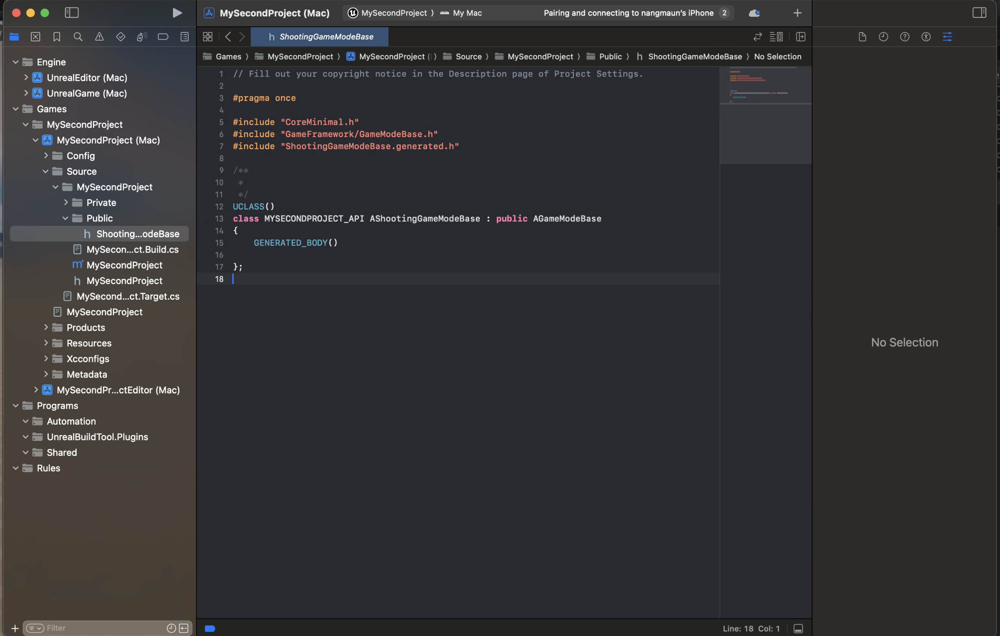

## cpp class 추가



c++ 프로젝트 생성

| cpp class 생성전 | cpp class 생성후 |
| --- | -- |
|  |  |


프로젝트를 생성후 에도 cpp class 가 보이지 않는다.\
오른쪽 setting을 클릭하여 ```show c++ class```를 보이게 설정 해준다.\
프로젝트에 c++ class를 추가해 주도록 한다.



상위에 ```tool``` -> ```New C++ Class```를 선택하여 

| 선택창 | 생성 |
| --- | -- |
|  |  |

생성해 주는 것으로 cpp클레스 폴더가 생성되는 것을 볼 수 있다.

또한 Xcode(필자는 맥을 이용중) 에서도 이러한 모습을 볼 수 있다. 

> [!NOTE]
>  다음 코드부터는 ```Rider``` 에디터를 사용할 예정이다.


> [!WARNING]
> 집접 폴더를 만드는 것은 추천하지 않는다
