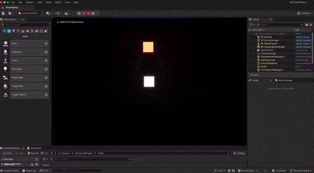

Particle 추가 방법



## Variable

Particle은 상위 처럼 컴포넌트 선언이 가능하며 

```cpp
	UPROPERTY(EditAnywhere)
	class UParticleSystemComponent* destroyParticle;	
```


## Create

```cpp

	// Destroy Particle
	destroyParticle = CreateDefaultSubobject<UParticleSystemComponent>(TEXT("PARTICLE"));
	ConstructorHelpers::FObjectFinder<UParticleSystem> tempParticle(TEXT("/Script/Engine.ParticleSystem'/Game/StarterContent/Particles/P_Explosion.P_Explosion'"));
	destroyParticle->SetAutoActivate(false);
	if (tempParticle.Succeeded())
	{
		// UE_LOG(LogTemp, Warning, TEXT("%s"), TEXT("Succeed Load"));
		destroyParticle->SetTemplate(tempParticle.Object);
	}
```

생성자에 이라헌 식으로 원하는 파티클을 추가해 줄수 있다.\
필자는 자동적으로 실행되는 부분을 ```false```로 설정하여 생성시 실행되지 않게 하였다.

## Activate

```cpp
void ADestroyEffect::DestroyEnemy()
{
	destroyParticle->Activate();
	this->SetLifeSpan(3);
}
```

상위처럼 선언된 효과를 실행 시키는 것으로 표현이 가능하며 \
이펙트가 끝나고 파괴를 해주기 위해 ```SetLifeSpan```함수를 사용하였다.


전체적인 코드는 아래와 같다
```cpp filename="DestroyEffect.h"
// Fill out your copyright notice in the Description page of Project Settings.

#pragma once

#include "CoreMinimal.h"
#include "GameFramework/Actor.h"
#include "DestroyEffect.generated.h"

UCLASS()
class MYSECONDPROJECT_API ADestroyEffect : public AActor
{
	GENERATED_BODY()
	
public:	
	// Sets default values for this actor's properties
	ADestroyEffect();

protected:
	// Called when the game starts or when spawned
	virtual void BeginPlay() override;

public:	
	// Called every frame
	virtual void Tick(float DeltaTime) override;

	// Sound Destroy
	UPROPERTY(EditAnywhere)
	class USoundBase* destroySound;
	UPROPERTY(EditAnywhere)
	class UParticleSystemComponent* destroyParticle;
	
	void DestroyEnemy();
};
```

```cpp filename="DestroyEffect.cpp"
// Fill out your copyright notice in the Description page of Project Settings.


#include "DestroyEffect.h"
#include "Kismet/GameplayStatics.h"
#include "Particles/ParticleSystemComponent.h"

// Sets default values
ADestroyEffect::ADestroyEffect()
{
 	// Set this actor to call Tick() every frame.  You can turn this off to improve performance if you don't need it.
	PrimaryActorTick.bCanEverTick = true;


	// Destroy Sound
	destroySound = CreateDefaultSubobject<USoundBase>(TEXT("SOUND"));
	ConstructorHelpers::FObjectFinder<USoundBase> tempSound(TEXT("/Script/Engine.SoundWave'/Engine/VREditor/Sounds/UI/Teleport_Committed.Teleport_Committed'"));
	
	if (tempSound.Succeeded())
	{
		destroySound = tempSound.Object;
	}

	// Destroy Particle
	destroyParticle = CreateDefaultSubobject<UParticleSystemComponent>(TEXT("PARTICLE"));
	ConstructorHelpers::FObjectFinder<UParticleSystem> tempParticle(TEXT("/Script/Engine.ParticleSystem'/Game/StarterContent/Particles/P_Explosion.P_Explosion'"));
	destroyParticle->SetAutoActivate(false);
	if (tempParticle.Succeeded())
	{
		// UE_LOG(LogTemp, Warning, TEXT("%s"), TEXT("Succeed Load"));
		destroyParticle->SetTemplate(tempParticle.Object);
	}
}

// Called when the game starts or when spawned
void ADestroyEffect::BeginPlay()
{
	Super::BeginPlay();

	DestroyEnemy();
}

// Called every frame
void ADestroyEffect::Tick(float DeltaTime)
{
	Super::Tick(DeltaTime);
}

void ADestroyEffect::DestroyEnemy()
{
	// Sound & Effect
	UGameplayStatics::PlaySound2D(GetWorld(), destroySound);
	// UGameplayStatics::PlaySoundAtLocation(this, destroySound, destroyParticle->GetComponentLocation());
	destroyParticle->Activate();
	this->SetLifeSpan(3);
}
```

