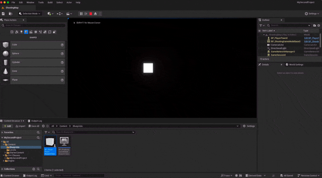

import { Callout } from 'nextra/components'

<Callout emoji="👾">
키 설정의 경우 아래 링크를 참고하기 바란다.\
[blueprint keybind](/unreal/blueprint/blueprint-keybind#input-key-binding-설정)
</Callout>

키 값을 코드화 하는 방법은 다음과 같다.


```cpp filename="PlayerPawn.h"
// Fill out your copyright notice in the Description page of Project Settings.

#pragma once

#include "CoreMinimal.h"
#include "GameFramework/Pawn.h"
#include "PlayerPawn.generated.h"

UCLASS()
class MYSECONDPROJECT_API APlayerPawn : public APawn
{
	GENERATED_BODY()

public:
	// Sets default values for this pawn's properties
	APlayerPawn();

protected:
	// Called when the game starts or when spawned
	virtual void BeginPlay() override;

public:	
	// Called every frame
	virtual void Tick(float DeltaTime) override;

	// Called to bind functionality to input
	virtual void SetupPlayerInputComponent(class UInputComponent* PlayerInputComponent) override;
    // Box component
    UPROPERTY(EditAnywhere)
    class  UBoxComponent* compBox;
    
    // StaticMesh component
    UPROPERTY(EditAnywhere)
    class UStaticMeshComponent* compMesh;

	// Horizonal & Vertical value;
	float h;
	float v;
	float speed = 100;
	
	// A, D Key bind 
	void InputHorizonal(float value);
	// W, S Key bind
	void InputVertical(float value);
};
```

헤더파일의 경우 키를 담을 값과 그에 따른 함수를 정의 한다.

```cpp filename="PlayerPawn.cpp"
// Fill out your copyright notice in the Description page of Project Settings.

#include "PlayerPawn.h"
#include "Components/BoxComponent.h"

// Sets default values
APlayerPawn::APlayerPawn()
{
 	// Set this pawn to call Tick() every frame.  You can turn this off to improve performance if you don't need it.
	PrimaryActorTick.bCanEverTick = true;
    
    // Box Component Create
    compBox = CreateDefaultSubobject<UBoxComponent>(TEXT("BOX"));
    // Set First Component
    SetRootComponent(compBox);
    // Set Box Size
	compBox->SetBoxExtent(FVector(50,50,50));
	
    // StaticMesh Component Create
    compMesh = CreateDefaultSubobject<UStaticMeshComponent>(TEXT("MESH"));
    // Set child Component of Box Component
	compMesh->SetupAttachment(compBox);

	// Load Cube StaticMesh
	ConstructorHelpers::FObjectFinder<UStaticMesh> tempMesh(TEXT("/Script/Engine.StaticMesh'/Engine/BasicShapes/Cube.Cube'"));
	
	// Load Success
	if (tempMesh.Succeeded())
	{
		// Input staticMesh data from tempMesh
		compMesh->SetStaticMesh(tempMesh.Object);
	}
	// Load Material
	ConstructorHelpers::FObjectFinder<UMaterial> tempMat(TEXT("/Script/Engine.Material'/Engine/BasicShapes/BasicShapeMaterial.BasicShapeMaterial'"));

	if (tempMat.Succeeded())
	{
		// Input compMesh data from tempMat
		compMesh->SetMaterial(0, tempMat.Object);
	}
}

// Called when the game starts or when spawned
void APlayerPawn::BeginPlay()
{
	Super::BeginPlay();
	
}

// Called every frame
void APlayerPawn::Tick(float DeltaTime)
{
	Super::Tick(DeltaTime);

	// Set Axis
	FVector dirH = FVector::YAxisVector * this->h;
	FVector dirV = FVector::XAxisVector * this->v;
	FVector dir = dirH + dirV;
	
	// Axis to be normalize
	dir.Normalize();
	
	// move to Direction
	// P = P0 + vt  (v : dir * speed
	FVector p0 = GetActorLocation();
	FVector vt = dir * this->speed * DeltaTime;
	SetActorLocation(p0 + vt);
}

// Called to bind functionality to input
void APlayerPawn::SetupPlayerInputComponent(UInputComponent* PlayerInputComponent)
{
	Super::SetupPlayerInputComponent(PlayerInputComponent);

	// Set InputHorizonal
	PlayerInputComponent->BindAxis(TEXT("Horizontal"),this, &APlayerPawn::InputHorizonal);
	// Set InputVertical
	PlayerInputComponent->BindAxis(TEXT("Vertical"),this, &APlayerPawn::InputVertical);
}

void APlayerPawn::InputHorizonal(float value)
{
	// UE_LOG(LogTemp, Warning, TEXT("H : %f"),  value)
	
	this->h = value;
}

void APlayerPawn::InputVertical(float value)
{
	// UE_LOG(LogTemp, Warning, TEXT("V : %f"),  value)
	this->v = value;
}
```

cpp 에서 키에대한 설정믈 부분식 나누어 설명해보자

```cpp
void APlayerPawn::InputHorizonal(float value)
{
	this->h = value;
}
 
void APlayerPawn::InputVertical(float value)
{
	this->v = value;
}
```
두함수는 set과 같은 역확을 하는 함수이다. 들어온 값을 class 변수에 정장한다.

```cpp
void APlayerPawn::SetupPlayerInputComponent(UInputComponent* PlayerInputComponent)
{
	Super::SetupPlayerInputComponent(PlayerInputComponent);
 
	// Set InputHorizonal
	PlayerInputComponent->BindAxis(TEXT("Horizontal"),this, &APlayerPawn::InputHorizonal);
	// Set InputVertical
	PlayerInputComponent->BindAxis(TEXT("Vertical"),this, &APlayerPawn::InputVertical);	
}
```

bind된 값이름이 변화할때 감지하여 한 엑터에 함수를 적용하는 작업을 한다.\
1. 첫번째 인자로는 바인드 되는 명칭
2. 두번째 인자로는 영향을 받을 클레스
3. 3번제로는 적용하려는 함수 (함수에는 value값이 주어지며 그에 따른 로직이 있어야 한다.)

이로서 방향을 지정해 줄 수 있게 된다.

```cpp

void APlayerPawn::Tick(float DeltaTime)
{
	Super::Tick(DeltaTime);

	// Set Axis
	FVector dirH = FVector::YAxisVector * this->h;
	FVector dirV = FVector::XAxisVector * this->v;
	FVector dir = dirH + dirV;
	
	// Axis to be normalize
	dir.Normalize();
	
	// move to Direction
	// P = P0 + vt  (v : dir * speed
	FVector p0 = GetActorLocation();
	FVector vt = dir * this->speed * DeltaTime;
	SetActorLocation(p0 + vt);
}
```

틱에 따라 지정된 방형으로 움직일 수 있도록 위치를 이동 시켜준다.

이러한 설정으로 키를 바인드하여 움직일 수 있다.

