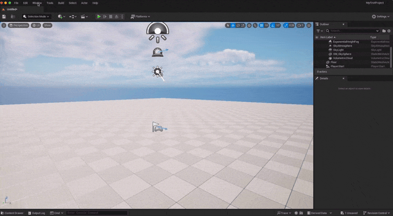

## actor 만들기



간단한 엑터를 만들어 보겠다.

박스 모형의 엑터를 만들고 ```Details panel``` 을 보면 박스에 대한 여러가지 값을 번경 할 수 있는 걸 볼 수 있다.

> [!TIP]
> ```level viewport``` 에서 ```Gizmo(기즈모)``` 설정을 할 수 있는데 ```Gizmo``` 로는 이동 회전 스케일이 있다.

또한 ```level viewport```에서 스넵(snap) 옵션과 카메라의 속성등을 설정 할 수 있다.

## Gizmo 단축키

| 단축키 | 효과 |
| --- | --- |
| q | 오브젝트 선택 |
| w | Gizmo 이동 모드 |
| e | Gizmo 회전 모드 |
| r | Gizmo 스케일 모드 |
