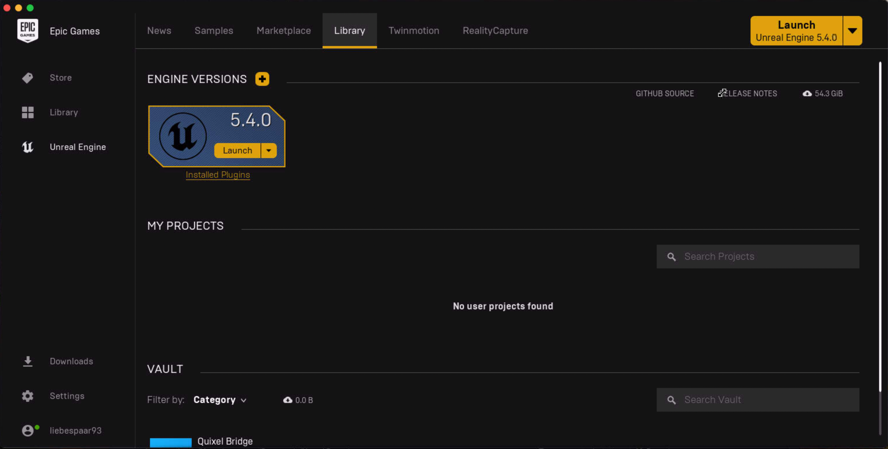
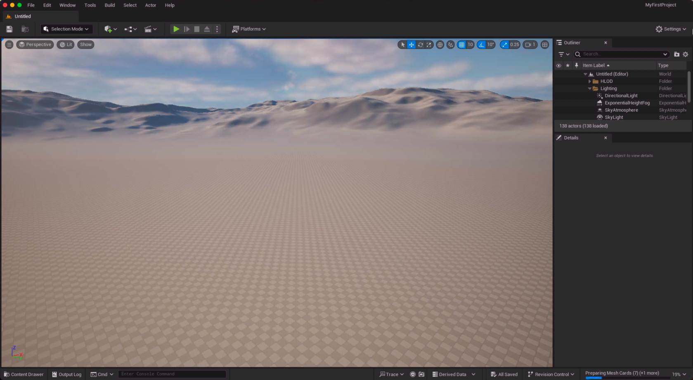

## Unreal Launcher 설치

언리얼 엔진 공식 사이트를 방문하여 설치한다.\
[https://www.unrealengine.com/](https://www.unrealengine.com/)

| Unreal Launcher | Unreal Library |
| --- | --- | 
| |  |

런처에서 원하는 라이브러리를 다운로드 받아 원하는 프로젝트에 맞는 설치를 진행 한다.

## Unreal Engine

설치가 완료되고 실행을 해보면 원하는 프로젝트를 만드는 창이 나오게 된다.\
기본적으로 옵션을 선택할 수가 있고 또한 내부에서도 수정이 가능하니 프로젝트 진행중 수정도 가능하다.

## Ureal Project

프로젝트가 새로 생성된것을 볼 수 있다
