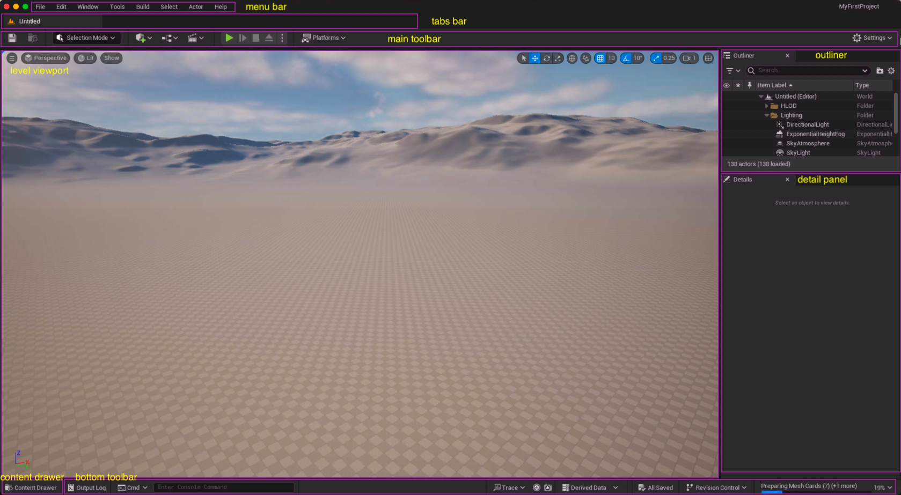
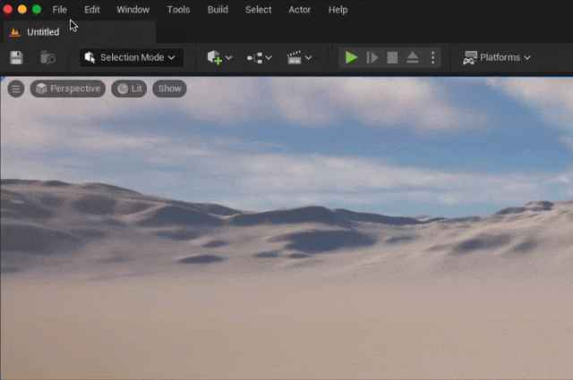
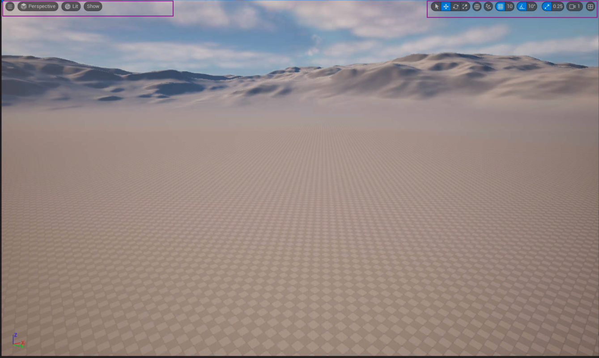
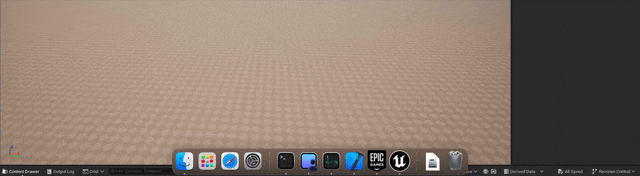
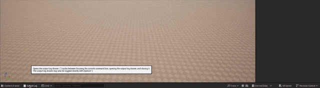

## Unreal Interface

| 명칭 | 설명 |
| --- | --- |
| Menu Bar | 다양한 상세 설정들을 할 수 있는 바이다 |
| Tab Bar | 내가 작업하는 Viewport의 목록을 보여준다 |
| Main Toolbar | 실제 작업중 가장 많이쓰는 단축키들이 세팅 되있다. |
| Level Viewport | 카메라 엑터 메쉬 등 콘텐츠를 볼 수 있는 레벨 뷰이다. |
| Content Drawer | 콘텐츠 파일들을 보기 위한 버튼 이다 |
| Bottom Toolbar | 프로젝트에 필요한 에셋을 접근하기 위한 풀 바 |
| Outliner | 콘텐츠를 보여주며 들의 구조도 같이 볼 수 있다. |
| Details panel | 선택한 엑터의 상세한 정보를 볼 수 있다. |

### Menu Bar

메뉴바에는 다양한 상세 옵션들을 설정 할 수 있다.

### Tab Bar

필요에 의해 작업 데쉬 보드를 목록화 하여 이동하며 사용이 가능하다.

### Main Toolbar

다양한 자주 사용하는 기능들이 준뵈되어 있어 편하게 사용이 가능하다

### Level Viewport

내가 작업하는 공간을 실시간으로 확인하기 위한 인터페이스다.

### Content Drawer

내 작업 폴더의 파일들을 집접적으로 볼 수 있다.

### Bottom Toolbar

### Outliner

엑터들의 목록과 상관 관계를 보기 편하게 되어있다.

### Details panel

세부사항들이 작성 되있다\
추후 자신의 노드를 만들었을 경우도 디테일 페널에 보이는 요소들를 고려하여 만들어야 한다.